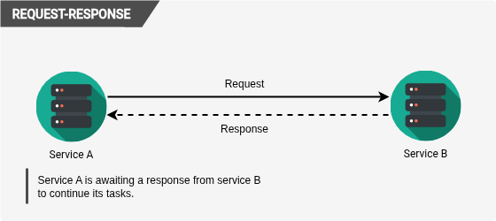
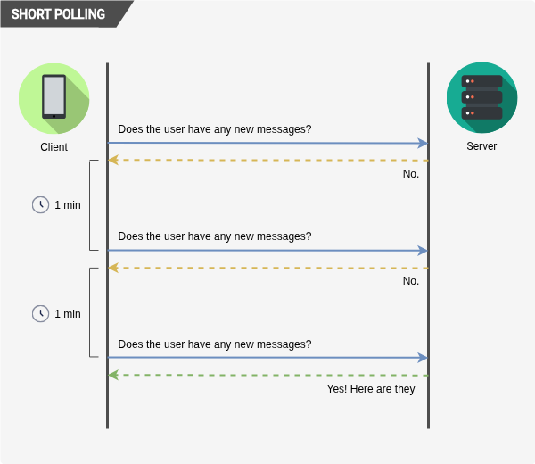
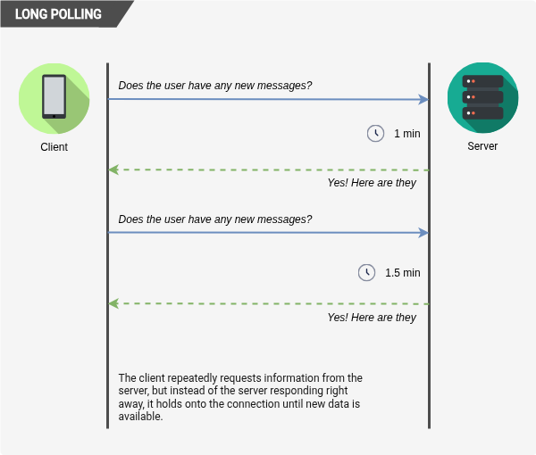
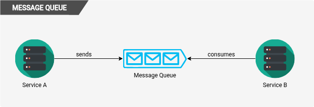
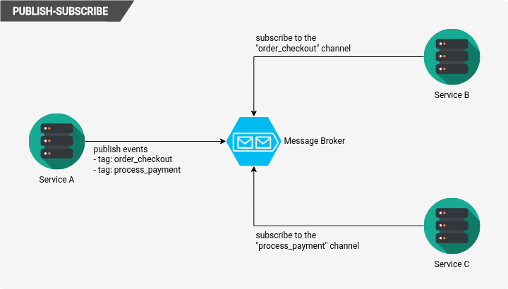
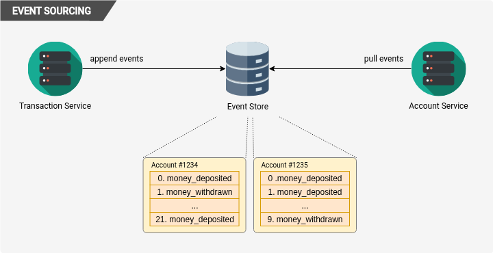
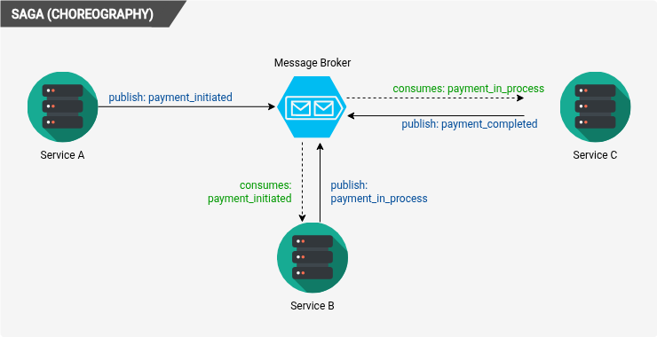

import Callout from '@/components/Callout.astro'

## Introduction
In software development, communication patterns refer to the various ways in which different components of a system interact and exchange information.
These patterns are crucial for designing scalable, maintainable, and efficient systems.
Understanding the different communication patterns can help developers choose the right approach for their specific use case,
whether it's synchronous or asynchronous communication.

<Callout title={"Synchronous communication"} variant={"definition"}>
  Synchronous communication is when a sender makes a request and waits for the receiver to process it and return a response before continuing.
  The interaction is **time-coupled**: both parties must be available at the same moment, and the caller’s control flow is blocked until the exchange completes.
</Callout>

<Callout title={"Asynchronous communication"} variant={"definition"}>
  Asynchronous communication is when a sender transmits a message and continues execution without waiting for the receiver to finish processing it.
  The interaction is **time-decoupled**: the receiver can handle the message later, and any response (if one exists) arrives separately and independently.
</Callout>

Besides the fundamental distinction between synchronous and asynchronous communication, we can also categorize communication
patterns based on their primitives, which are the basic building blocks of communication.
These primitives can be combined in various ways to create more complex patterns.

#### Request-Response (the only synchronous primitive)
Request-Response is an interaction pattern in which one party (the requester) sends a message to another party
(the responder) and waits for a corresponding reply that directly answers that specific request.
The two messages are causally linked and form a single logical exchange: the requester initiates, the responder processes,
and a response is returned before the interaction is considered complete.

This primitive is typically blocking and time-coupled, meaning **the requester cannot proceed with dependent work until
the response is received**, making it the foundational building block of synchronous communication.

#### One-Way Send (Fire-and-Forget)
It is the most basic asynchronous primitive. In the One-Way Send (Fire-and-Forget) primitive, **the sender transmits a message to a receiver without expecting any response or acknowledgment**.
Once the message is sent, the sender immediately continues execution, making the interaction non-blocking and time-decoupled.
The receiver may process the message immediately, later, or even not at all, depending on system guarantees.

#### Deferred Response (Split Request-Response)
This is a asynchronous primitive in which **a requester sends a message to initiate work but does not wait for the final result within the same interaction**.
Instead, the response is delivered later through a separate communication step, either by the requester polling for completion or
by the responder pushing the result back through a callback or message channel.

This splits the request and reply across time, removing immediate blocking while preserving a logical correlation between the original request and its eventual outcome.
It enables long-running or resource-intensive operations to be handled without tying up the caller’s execution flow.

#### Streaming (Persistent Connection)
This is an asynchronous primitive where **two parties establish a long-lived connection over which multiple messages can be sent independently over time**.
Instead of completing after a single request–response exchange, the channel remains open, allowing one or both sides to continuously
transmit data without renegotiating a new interaction for each message.

Messages flow as discrete units within the same session, and neither side is required to block per message unless the application chooses to.

<Callout title={"Delivery Guarantees"} variant={"definition"}>
  Delivery guarantees describe the promises a communication system makes about how messages are delivered between sender and receiver.
  These guarantees are fundamental in distributed systems because they determine how much reliability, deduplication logic, and
  state management must be handled at the application level.

  The three main types of delivery guarantees are:
  - **At Most Once**: Messages are delivered zero or one time, with no retries. This can lead to message loss but prevents duplicates.
  - **At Least Once**: Messages are retried until acknowledged, ensuring delivery but potentially resulting in duplicates.
  - **Exactly Once**: Messages are guaranteed to be delivered exactly once, often requiring complex coordination to achieve this level of reliability.

</Callout>

#### Deriving Patterns from Primitives
We can derive various communication patterns by combining these primitives in different ways.
Below are some common patterns categorized by their synchronous or asynchronous nature.

#### Request-Response
**Primitives**: Request-Response

This one does not require any further explanation, as it is the only synchronous primitive.
It is the most straightforward communication pattern where a client sends a request and waits for a response from the server before proceeding.

#### Short Polling
**Primitives**: Request-Response

Short Polling or Polling is a communication pattern where the client repeatedly sends requests to the server at regular intervals to check for new data or updates.
While it is simple to implement, it can lead to inefficiencies and increased latency, especially if the server has no new data to provide,
as the client may be making unnecessary requests.

#### Long Polling
**Primitives**: Request-Response

Long Polling is an alternative to short polling that allows the server to hold the client's request open until new data is available or a timeout occurs.
This reduces the number of requests made by the client and can provide a more real-time experience, but it still relies on the request-response primitive
and can lead to increased latency if the server takes a long time to respond.

#### Message Queues
**Primitives**: One-Way Send (Fire-and-Forget), Deferred Response (Split Request-Response)

Message queues are a common asynchronous communication pattern where messages are sent to a queue and processed by one or more consumers which the sender does not need to be aware of.
This allows for decoupling between the sender and receiver, as the sender can continue processing without waiting for the receiver to handle the message.
Message queues can provide various delivery guarantees and can be used for load balancing, background processing, and handling asynchronous workflows.

#### Publish-Subscribe
**Primitives**: One-Way Send (Fire-and-Forget), Deferred Response (Split Request-Response)

The Publish-Subscribe pattern is an asynchronous communication pattern where messages are published to a topic or channel, and multiple subscribers can receive those messages based on their interests.
This allows for a decoupled architecture where publishers and subscribers do not need to be aware of each other, and messages can be delivered to multiple recipients simultaneously.
Publish-Subscribe is commonly used for real-time notifications, event-driven architectures, and broadcasting messages to multiple consumers.

#### Webhooks
**Primitives**: One-Way Send (Fire-and-Forget), Deferred Response (Split Request-Response)

Webhooks are a communication pattern where one system sends an HTTP request to another system when a specific event occurs. The receiving system can then process the request and respond accordingly.
Webhooks are often used for integrating different systems, allowing them to communicate in real-time without the need for polling. They are commonly used for triggering actions in response to events,
such as sending notifications, updating data, or invoking workflows.

> I think a very common use case for webhooks is payment processing, where a payment gateway can send a webhook to the merchant's system when a payment is completed,
> allowing the merchant to update their records and fulfill the order without needing to poll the payment gateway for updates.

#### Event Sourcing
**Primitives**: One-Way Send (Fire-and-Forget), Deferred Response (Split Request-Response)

Event Sourcing is a communication pattern where changes to the application state are represented as a sequence of events.
Instead of storing the current state directly, the system stores a log of all events that have occurred.
This allows for a more flexible and auditable system, as the state can be reconstructed by replaying the events.
Event Sourcing is often used in conjunction with Command Query Responsibility Segregation (CQRS) and can be beneficial
for systems that require complex business logic, auditing, or the ability to easily roll back to previous states.

#### Saga (Choreography)
**Primitives**: One-Way Send (Fire-and-Forget), Deferred Response (Split Request-Response)

Saga (Choreography) is a communication pattern used to manage long-running transactions in a distributed system.
In this pattern, each service involved in the transaction performs its work and then publishes an event to signal the next step in the process.
Each service listens for specific events and reacts accordingly, allowing for a decentralized approach to managing the transaction.
This pattern can help to ensure data consistency across services while allowing for loose coupling and scalability.

#### Saga (Orchestration)
**Primitives**: One-Way Send (Fire-and-Forget), Deferred Response (Split Request-Response)

Orchestration is a communication pattern used to manage long-running transactions in a distributed system, similar to _Choreography_.
However, in this pattern, a central orchestrator service is responsible for coordinating the transaction across multiple services.

**The orchestrator sends commands to each service involved in the transaction and waits for their responses before proceeding to the next step**.
This pattern can help to ensure data consistency and provide better control over the transaction flow,
but it can also introduce a single point of failure and tighter coupling between services.

#### Change Data Capture (CDC)
**Primitives**: One-Way Send (Fire-and-Forget), Deferred Response (Split Request-Response)

Change Data Capture (CDC) is a communication pattern where changes to a database are captured and propagated to other systems in real-time.
This allows for near real-time data synchronization between systems and can be used for various purposes, such as data replication, event-driven architectures, and integrating legacy systems with modern applications.
CDC can be implemented using various technologies, such as database triggers, log-based capture, or third-party tools that monitor database changes.

#### WebSockets
**Primitives**: Streaming (Persistent Connection)

WebSockets are a type of persistent connection that allows for full-duplex communication between a client and a server over a single TCP connection.
This means that both the client and server can send messages to each other independently without the need for the client to wait for a response before sending another message.
WebSockets are commonly used for real-time applications, such as chat applications, live updates, and online gaming, where low latency and bidirectional communication are essential.

#### Server-Sent Events (SSE)
**Primitives**: Streaming (Persistent Connection)

Server-Sent Events (SSE) is a communication pattern where a server can push updates to a client over a single HTTP connection.
The client establishes a connection to the server and listens for updates, which the server can send as they become available.

This allows for real-time updates without the need for the client to poll the server for new data.
SSE is often used for applications that require real-time notifications, such as news feeds, stock price updates, or live sports scores.

#### Batch Processing
**Primitives**: One-Way Send (Fire-and-Forget), Deferred Response (Split Request-Response)

In Batch Processing, a large volume of data is collected and processed together at a later time, rather than processing each piece of data individually as it arrives.
This communication pattern is often used for tasks that can be performed offline or do not require immediate results,
such as data analysis, report generation, or bulk updates.

The sender can submit a batch job and continue with other work, while the processing of the batch occurs asynchronously in the background.
Once the batch processing is complete, **the results can be retrieved or notified to the sender through a deferred response mechanism**.

#### Fan In
**Primitives**: One-Way Send (Fire-and-Forget), Deferred Response (Split Request-Response)

Fan In is a communication pattern where multiple sources send messages to a single destination, which processes the incoming messages and produces a consolidated result.
This pattern is often used in scenarios where data from multiple sources needs to be aggregated or processed together,
such as in data warehousing, log aggregation, or real-time analytics.

The destination can process messages as they arrive or wait until a certain number of messages have been received before processing,
depending on the specific use case and requirements.

#### Fan Out
**Primitives**: One-Way Send (Fire-and-Forget), Deferred Response (Split Request-Response)

Fan Out is a communication pattern where a single source sends messages to multiple destinations, allowing for parallel processing of the messages.
This pattern is often used in scenarios where a task can be performed independently by multiple workers, such as in distributed computing, load balancing, or event broadcasting.

<Callout title={"Publish-Subscribe vs Fan Out"} variant={"remark"}>
  While both Fan Out and Publish-Subscribe involve sending messages to multiple destinations, they serve different purposes.
  **Fan Out is focused on distributing work across multiple workers for parallel processing**, while **Publish-Subscribe
  is focused on broadcasting messages to multiple subscribers based on their interests**.
</Callout>

