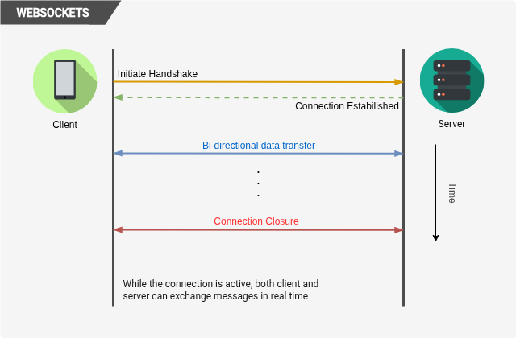

import Callout from '@/components/Callout.astro'

## Introduction
WebSockets are a protocol that enables full-duplex communication channels over a single TCP connection.
They are designed to be used in web applications to allow for real-time communication between the client and server.
Unlike traditional HTTP requests, which are stateless and require a new connection for each request,
WebSockets maintain a persistent connection that allows for continuous data exchange.

## How WebSockets Work?
A WebSocket connection is established through a handshake process that starts with an HTTP request from the client to the server.
The client sends an HTTP request with an `Upgrade` header to indicate that it wants to establish a WebSocket connection.
If the server supports WebSockets, it responds with a `101 Switching Protocols` status code and the connection is upgraded to a WebSocket connection.
Once the connection is established, both the client and server can send messages to each other at any time without the need for additional HTTP requests.



**Initiate handshake:** The client initiates the handshake by sending an HTTP request with an `Upgrade` header set to `websocket` to the server.

```http
GET /chat HTTP/1.1
Host: chat.server.com
Upgrade: websocket
Connection: Upgrade
Sec-WebSocket-Key: dGhlIHNhbXBsZSBub25jZQ==
Sec-WebSocket-Version: 13
```

**Server response:** If the server supports WebSockets, it responds with a `101 Switching Protocols` status code and the connection is upgraded to a WebSocket connection.

```http
HTTP/1.1 101 Switching Protocols
Upgrade: websocket
Connection: Upgrade
Sec-WebSocket-Accept: s3pPLMBiTxaQ9kYG+9Q==
```

**Full-duplex communication:** Once the connection is established, both the client and server can send messages
to each other at any time without the need for additional HTTP requests.

**Connection closure:** Either the client or server can close the connection at any time by sending a close frame.

## Implementation challenges
While WebSockets provide a powerful way to enable real-time communication in web applications, there are some implementation challenges to consider:

#### Proxy and firewall issues
WebSockets can be blocked by proxies and firewalls that do not recognize the WebSocket protocol, which can lead to connectivity issues for users behind such network configurations.

#### Scalability
Handling a large number of concurrent WebSocket connections can be challenging, especially in scenarios where the server needs to broadcast messages to many clients.
This requires careful consideration of server resources and may necessitate the use of load balancers and distributed systems to manage the connections effectively.

#### Fallback mechanisms
In cases where WebSockets are not supported or blocked, it is important to implement fallback mechanisms, such as long polling or Server-Sent Events (SSE),
to ensure that users can still receive real-time updates.

#### Network issues
WebSockets can be affected by network issues such as latency, packet loss, and connection drops, which can impact the user experience.
To mitigate these issues, we can implement reconnection strategies and heartbeat mechanisms to maintain the connection and ensure that messages are delivered reliably.

#### Security considerations
When using WebSockets, it is important to consider security implications, such as ensuring that the connection is encrypted using TLS (wss://)
to protect against eavesdropping and man-in-the-middle attacks.
Additionally, it is crucial to implement proper authentication and authorization mechanisms to prevent unauthorized access to the
WebSocket server and to validate incoming messages to protect against injection attacks and other malicious activities.

