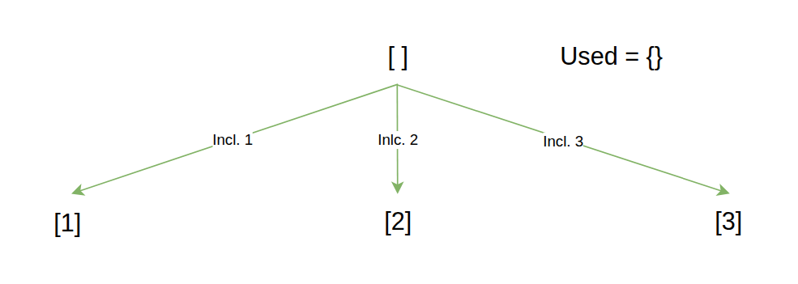
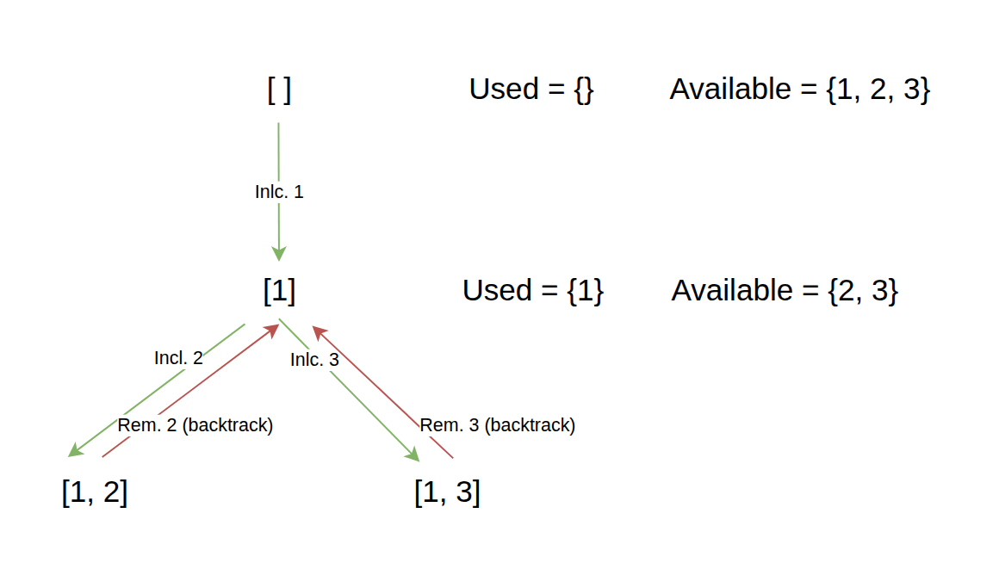
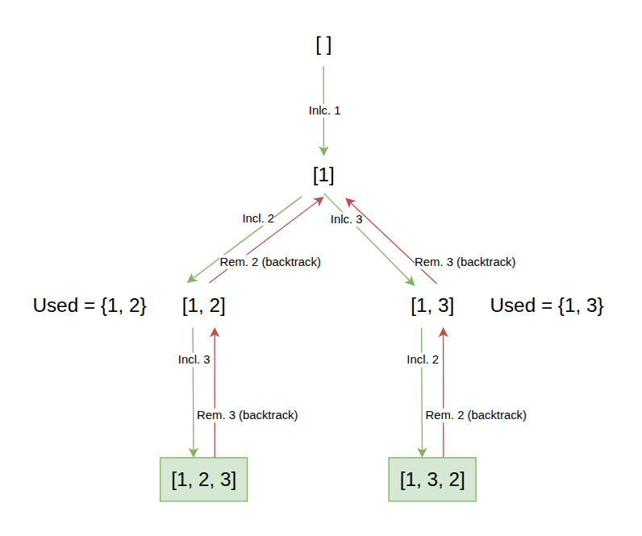
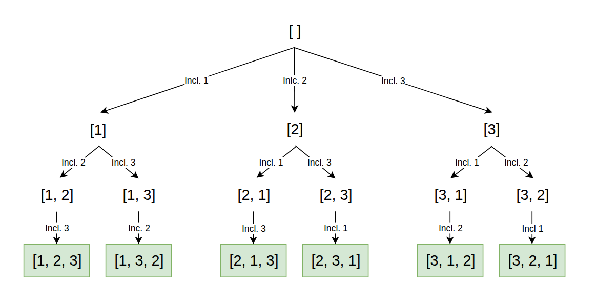

import Callout from '@/components/Callout.astro'

## Introduction
A permutation is defined as an arrangement of all the members of a set into some sequence or order.
For example, the permutations of the set `{1, 2, 3}` are:
```python
[
  [1, 2, 3],
  [1, 3, 2],
  [2, 1, 3],
  [2, 3, 1],
  [3, 1, 2],
  [3, 2, 1]
]
```

A classic DSA problem used to teach this variant of backtracking is the "Find All Permutations" problem,
which asks us to find all possible permutations of a given list of unique numbers.

<Callout title="Problem Statement" variant="proposition">
  Given an array nums of distinct integers, return all the possible permutations. You can return the answer in any order.

  Example:
  >Input: nums = [1,2,3] <br/>
  >Output: [[1,2,3], [1,3,2], [2,1,3], [2,3,1], [3,1,2], [3,2,1]]
</Callout>

In the following sections we will discover how to use backtracking to solve this kind of problem step by step.

## Building the decision tree
The first step to solve this problem is to build the decision tree, which is a visual representation of all the possible
decisions we can make at each step of the algorithm. In this case, we can start with an empty list and at each step we can
add one of the remaining numbers to the list until we have a complete permutation.

Let's build the decision tree for the input `[1, 2, 3]`:

When we start our candidate permutation is empty, and we have three available: `1`, `2`, and `3`.
We can choose any of these numbers to add to our candidate permutation. So we create three branches in our decision tree, one for each choice.



To understand the remaining layers, we will focus on the first branch of the decision tree, which is when we choose `1` as the first number of our permutation.
In this case, our candidate permutation is now `[1]`, and we have two remaining numbers: `2` and `3`.

We can choose any of these numbers to add to our candidate permutation, so we create two branches in our decision tree, one for each choice.



And finally for each of the branches we can choose the remaining number to add to our candidate permutation, which will give us a complete permutation.



Let's summarize the decision tree for the input `[1, 2, 3]`:



From the decision tree, we can see that we must to keep track of three things:
1. The current permutation we are building (candidate).
2. The remaining numbers that we can use to build the permutation (choices).
3. The list of all the complete permutations we have found so far (results).

These three components are essential to our algorithm, the DFS function must always receive these three values as parameters,
and we must update them accordingly at each step of the algorithm.


## Identifying the base case
The base case is the condition that will stop the recursion.
In this problem, the base case is when we have a complete permutation, which means that the length of the current permutation is
equal to the length of the input array. When we reach this base case, we can add the current permutation to our results list.

```python
if len(candidate) == len(nums):       # verify if we have a complete permutation
    results.append(candidate.copy())  # add the current permutation to the results list
    return                            # stop the recursion
```

## Exploring the decision tree
To explore the decision tree, we need to iterate over the remaining numbers (choices) and for each number, we need to:
1. Add the number to the current permutation (candidate).
2. Remove the number from the remaining numbers (choices).
3. Recursively call the DFS function with the updated candidate and choices.
4. Remove the number from the current permutation (backtrack) and add it back to the remaining numbers (backtrack).

```python
def backtrack(nums, candidate, used, results):
    ...

    for num in nums:
        if num in used:  # skip the number if it has already been used
            continue

        # make a choice
        candidate.append(num)  # add the number to the current permutation
        used.add(num)            # mark the number as used

        # explore the decision tree
        backtrack(nums, candidate, used, results)

        # backtrack
        candidate.pop()           # remove the number from the current permutation
        used.remove(num)          # mark the number as unused
```

## Final implementation
Putting everything together, we can implement the final solution as follows:

```python
def permute(nums):
    results = []
    backtrack(nums, [], set(), results)
    return results


def backtrack(nums, candidate, used, results):
    if len(candidate) == len(nums):       # verify if we have a complete permutation
        results.append(candidate.copy())  # add the current permutation to the results list
        return                            # stop the recursion

    for num in nums:
        if num in used:  # skip the number if it has already been used
            continue

        # make a choice
        candidate.append(num)  # add the number to the current permutation
        used.add(num)            # mark the number as used

        # explore the decision tree
        backtrack(nums, candidate, used, results)

        # backtrack
        candidate.pop()           # remove the number from the current permutation
        used.remove(num)          # mark the number as unused
```