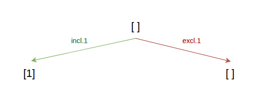
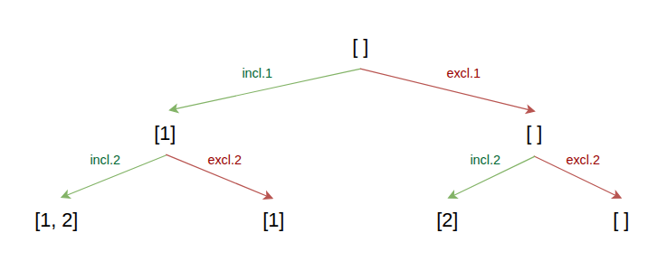
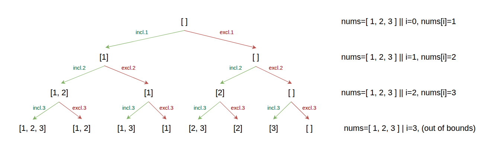

import Callout from '@/components/Callout.astro'

## Introduction
A subset is a set that contains some or all of the elements of another set.
For example, if we have a set `{A, B, C}`, the subsets of this set are: `{}`, `{A}`, `{B}`, `{C}`, `{A, B}`, `{A, C}`, `{B, C}`, and `{A, B, C}`.

When we group all possible subsets of a set, we call this collection the **power set**.
Finding this power set is a common problem in computer science, and it can be solved using backtracking.

<Callout title="Problem Statement" variant="proposition">
  Given an integer array nums of unique elements, return all possible subsets (_the power set_).

  The solution set **must not** contain duplicate subsets. Return the solution in **any order**.

  >Example 1: <br/>
  >
  >Input: nums = [1, 2, 3]<br/>
  >Output: [[], [1], [2], [1, 2], [3], [1, 3], [2, 3], [1, 2, 3]]<br/>

  >Example 2:<br/>
  >
  >Input: nums = [0]<br/>
  >Output: [[], [0]]<br/>
</Callout>

## Building the decision tree
To solve this problem, we can build a decision tree that represents all the possible subsets of the given set.
The decision tree will have a depth equal to the number of elements in the input array, and at each level of the tree,
we will decide whether to include or exclude the current element.

Let's analyze the first level of the decision tree.

The first element of the input array is `1`, so we have two
options: include `1` in the subset or exclude `1` from the subset. This gives us two branches in the decision tree.



Next, we move to the second level of the decision tree.
The second element of the input array is `2`, so we have two options for each branch of the first
level: include `2` in the subset or exclude `2` from the subset. This gives us four branches in the decision tree.



Finally, we move to the third level of the decision tree. The third element of the input array is `3`, so
we have two options for each branch of the second level: include `3` in the subset or exclude `3` from the subset.



<Callout title="" variant="important">
  At each layer, we need to keep track of the current element we are considering, and we need to make two recursive
  calls: one to include the current element in the subset and another to exclude it.
</Callout>

Now we have to formalize the components of our backtracking algorithm based on the decision tree we just built.
We need to keep track of four things:
1. The current subset we are building (candidate).
2. The numbers that we can use to build the subset (nums).
3. The index of the current element we are considering (index).
4. The list of all the complete subsets we have found so far (results).

## Identifying the base case
The base case is the condition that will stop the recursion. In this problem, the base case is when we have considered all
the elements in the input array, which means that the index is equal to the length of the input array. When we reach this base
case, we can add the current subset to our results list.

> The stop condition is when we have reached the leaf nodes of the decision tree "index = len(nums)".

```python
def backtrack(candidate, nums, index, results):
    if index == len(nums):
        results.append(candidate.copy())
        return
```


## Exploring the decision tree
To explore the decision tree, we need to make two recursive calls at each step of the algorithm:
1. One call to include the current element in the subset.
2. Another call to exclude the current element from the subset.
```python
def backtrack(candidate, nums, index, results):
    # ...

    # Include the current element in the subset
    candidate.append(nums[index])
    backtrack(candidate, nums, index + 1, results) # explore the left subtree

    candidate.pop()  # backtrack
    # Exclude the current element from the subset
    backtrack(candidate, nums, index + 1, results) # explore the right subtree
```

## Final implementation
With all the components in place, we can now implement the final solution to the problem.

```python
def subsets(nums):
    results = []
    backtrack([], nums, 0, results)
    return results

def backtrack(candidate, nums, index, results):
    if index == len(nums):
        results.append(candidate.copy())
        return

    # Include the current element in the subset
    candidate.append(nums[index])
    backtrack(candidate, nums, index + 1, results) # explore the left subtree

    candidate.pop()  # backtrack
    # Exclude the current element from the subset
    backtrack(candidate, nums, index + 1, results) # explore the right subtree
```