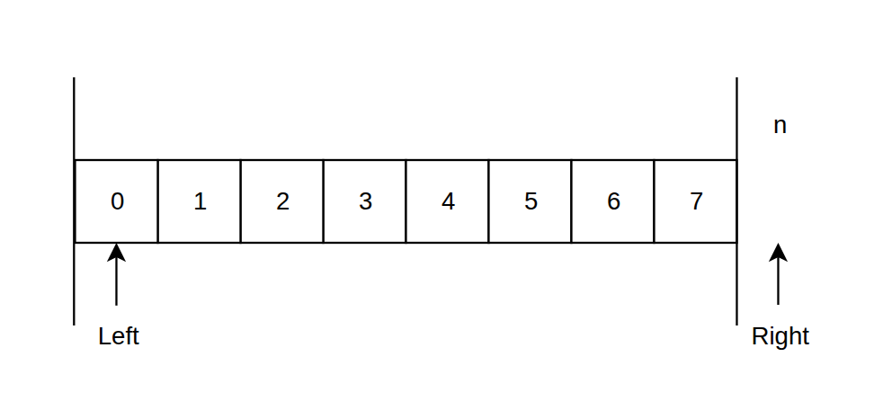
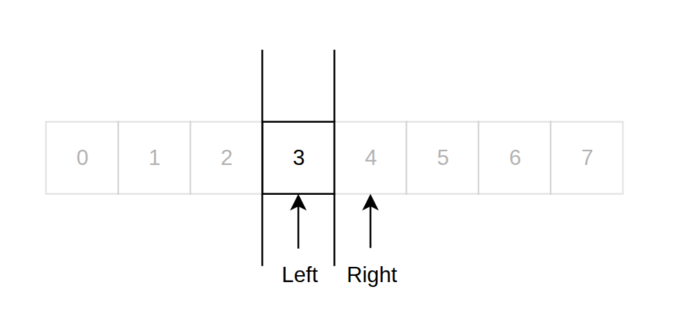
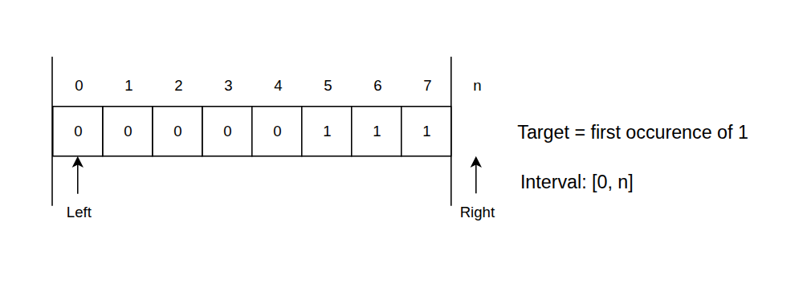
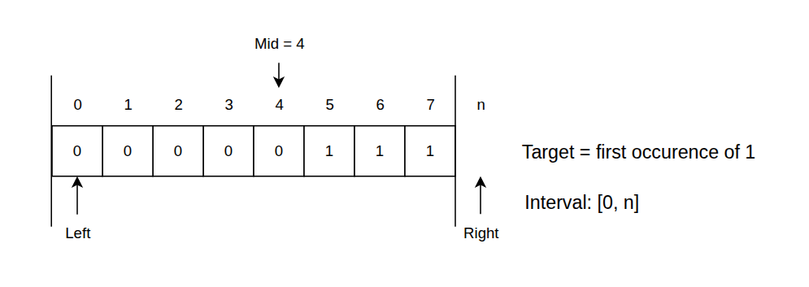
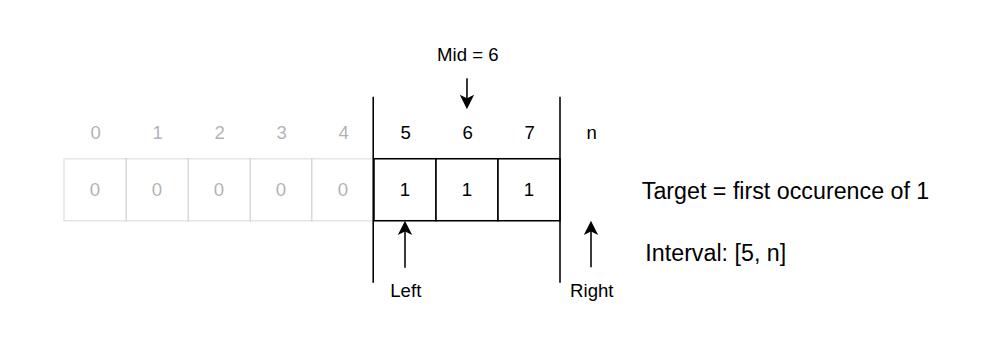
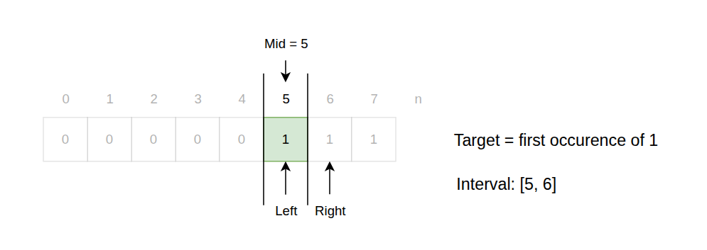
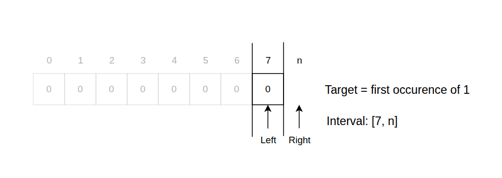

import Callout from '@/components/Callout.astro'

## The search space
In search by boundary, we work with a half-open search space, where the `left` pointer is inclusive and the `right` pointer is exclusive.
This means that all elements between `left` and `right`, including the element at the `left` index but excluding the element at the `right` index,
are considered part of the search space.



We use search by boundary when we want to find the position of the first element that satisfies a certain condition.
In this case, **we want to reduce the search space until we have only one element left**, this way, out interval will contain
the index of the first element that satisfies the condition (if such an element exists).

<Callout title={"Convergence condition"} variant={"important"}>
  We want our algorithm to run until there is **only one element left in the search space**, that is: <br/>

  ```python
  while left < right
  ```
</Callout>



## The algorithm
This variant of binary search is very similar to the search by value,
but instead of comparing the middle element with a target value, we compare it with a condition.
1. If the middle element satisfies the condition, it means that the first element that satisfies the condition must be
in the left half of the search space (including the middle element). Therefore, we can move the `right` pointer to `mid`,
effectively discarding the right half of the search space.
2. If the middle element does not satisfy the condition, it means that the first element that satisfies the condition must
be in the right half of the search space. Therefore, we can move the `left` pointer to `mid + 1`, effectively discarding
the left half of the search space (including the middle element).
3. When the search space is reduced to a single element, we can check if this element satisfies the condition.
If it does, we return its index; otherwise, we return an indication that no such element exists.

Let's try to apply this to an example.

```
Input: nums = [0, 0, 0, 0, 0, 1, 1, 1]
Condition: find the index of the first element that is equal to 1
```



1. The first task is to position our `left` and `right` pointers at the beginning and end of the array, respectively.
But the `right` pointer is exclusive, so we position it at the length of the array instead of the last index.



2. Next, while we have more than one element in the search space, we calculate the middle index and compare the middle element with the condition.
3. In this case, the middle element is `0`, which does not satisfy our condition (we are looking for the first element that is equal to `1`).
This means that the first element that satisfies the condition must be in the right half of the search space.
Therefore, we move the `left` pointer to `mid + 1`, which is index `5`.



4. Now we have a new search space defined by the indices `5` to `8`. We calculate the middle index again and compare the middle element with the condition.
5. Our middle element is now `1`, which satisfies our condition. This means that the first element that satisfies the condition must be in the left half of the search space (including the middle element).
Therefore, we move the `right` pointer to `mid`, which is index `6`.



6. Now we have a new search space defined by the indices `5` to `6`. Since there is only one element left in the search space,
we can check if this element satisfies the condition.
7. In this case, the only element left in the search space is `1`, which satisfies our condition.
This means that we have found the first element that satisfies the condition and we can return its index, which is `5`.

<Callout title={"Why the final answer is pointed by 'left'?"} variant={"important"}>
  In this binary search variant the `left` and `right` pointers have different roles.
  The `left` pointer is the one that moves to the right when the middle element does not satisfy the condition,
  while the `right` pointer moves to the left when the middle element satisfies the condition.

  Note that when the `left` pointer changes, it always moves to `mid + 1`, which means that it always avoids the middle element that does not satisfy the condition.
  On the other hand, when the `right` pointer changes, it always moves to `mid`, which means that it always includes the middle element that satisfies the condition.

  But running the algorithm this way, we must account for two edge cases:
1. If there is no element that satisfies the condition, the `left` pointer will eventually move to the end of the array, which is an invalid index. In this case, we can check if the `left` pointer is equal to the length of the array to determine that no such element exists.
2. The element that satisfies the condition is the last element of the array. In this case, the `right` pointer will always be out of bounds, but the `left` pointer will eventually point to the last element of the array, which is the correct answer.



  We can conclude that the `left` pointer is the only one that will be maintained within the bounds of the array.
</Callout>

## Implementation
Here is the implementation of the search by boundary algorithm in Python:
```python
def binary_search(nums, condition):
    n = len(nums)
    left = 0           # Initialize the left pointer to the beginning of the array
    right = n          # Initialize the right pointer to the length of the array (exclusive)

    # Reduce the search space until there is only one element left
    while left < right:
        # Calculate the middle index of the current search space
        mid = left + (right - left) // 2

        # Compare the middle element with the condition
        if condition(nums[mid]):
            # Move the right pointer to mid, keeping the middle element in the search space
            right = mid
        else:
            # Move the left pointer to mid + 1, discarding the middle element from the search space
            left = mid + 1

    # Verify if the remaining element satisfies the condition
    if left < n and condition(nums[left]):
        return left

    return -1  # Indication that no such element exists