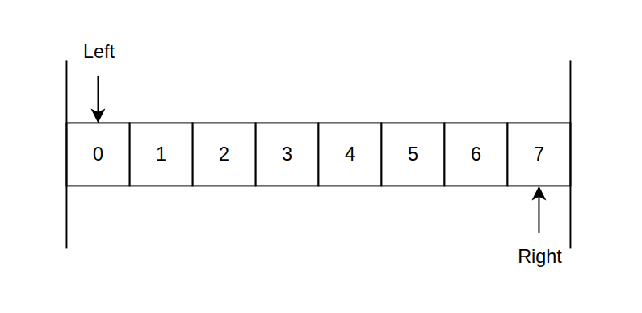
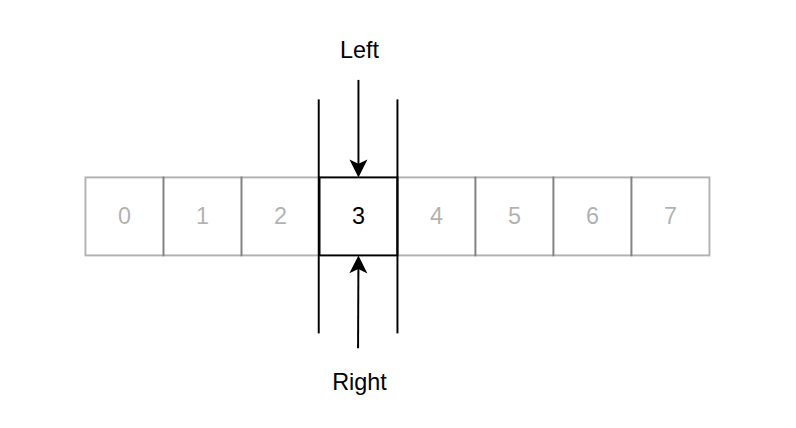
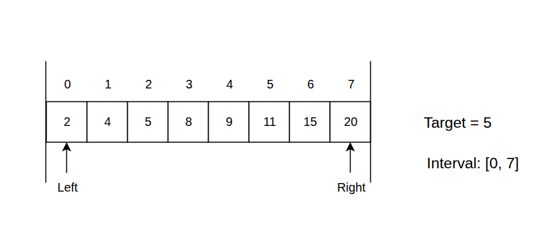
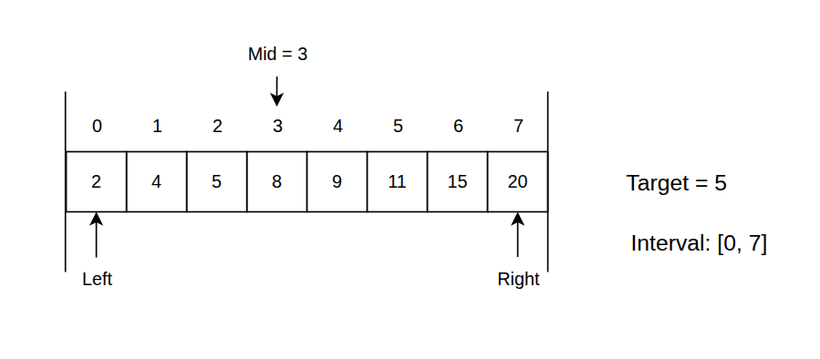
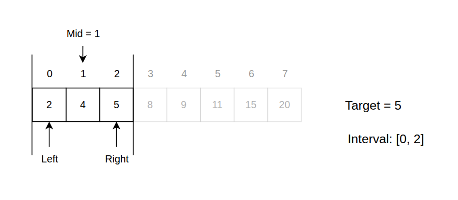
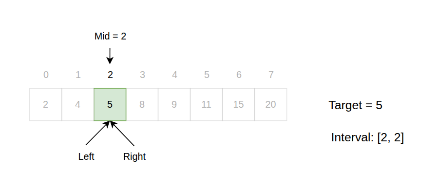

import Callout from '@/components/Callout.astro'

## The search space
In search by value, we work with a closed search space, where both `left` and `right` pointers are inclusive.
This means that all elements between `left` and `right`, including the elements at these indices, are considered part of the search space.



Our job here is to find the one and only element that matches the target value. We want to **reduce this search space until we have no elements left.**
Since we are working with a closed interval, what we want here is to shrink the search space until `left` and `right` converge to the same index,
which will be the position of the target value if it is present in the array.

<Callout title={"Convergence condition"} variant={"important"}>
We want our algorithm to run until there is **no elements left in the search space**, that is: <br/>

  ```python
  while left <= right
  ```
</Callout>



## The algorithm
The algorithm works by comparing the target value with the middle element of the current search space.
Based on this comparison, we can determine which half of the search space to explore next.
1. If the middle element is equal to the target value, we have found our target and can return its index.
2. If the middle element is less than the target value, it means that the target value must be in the right half of the search space. Therefore, we can move the `left` pointer to `mid + 1`, effectively discarding the left half of the search space.
3. If the middle element is greater than the target value, it means that the target value must be in the left half of the search space. Therefore, we can move the `right` pointer to `mid - 1`, effectively discarding the right half of the search space.

Let's try to apply this to an example.

```
Input: nums = [2, 4, 5, 8, 9, 11, 15, 20]
Target = 5
```



1. The first task is to position our `left` and `right` pointers at the beginning and end of the array, respectively.




2. Next, while we have more than one element in the search space, we calculate the middle index and compare the middle element with the target value.
3. In this case, the middle element is `8`, which is greater than our target value `5`. This means that the target value
must be in the left half of the search space. Therefore, we move the `right` pointer to `mid - 1`, which is index `2`.



4. Now we have a new search space defined by the indices `0` to `2`. We calculate the middle index again and compare the middle element with the target value.
5. Out middle element is now `4`, which is less than our target value `5`. This means that the target value must be in the right
half of the search space. Therefore, we move the `left` pointer to `mid + 1`, which is index `2`.



6. In this case, the middle element is `5`, which is equal to our target value. This means that we have found our target and can return its index, which is `2`.

## Implementation
Here is the implementation of the search by value algorithm in Python:

```python
def binary_search(nums, target):
    n = len(nums)

    # Initialize the left and right pointers to define the search space
    left = 0
    right = n - 1

    # Loop until the search space is reduced to one element
    while left <= right:
        # Calculate the middle index of the current search space
        mid = left + (right - left) // 2

        # Compare the middle element with the target value
        if nums[mid] == target:
            return mid
        elif nums[mid] < target:  # If the middle element is less than the target value
            left = mid + 1        # cut the left half of the search space
        else:
            right = mid - 1       # cut the right half of the search space

    return -1  # Target value not found in the array
```