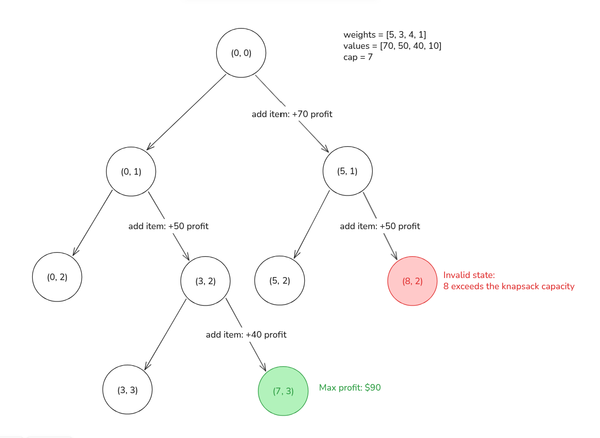
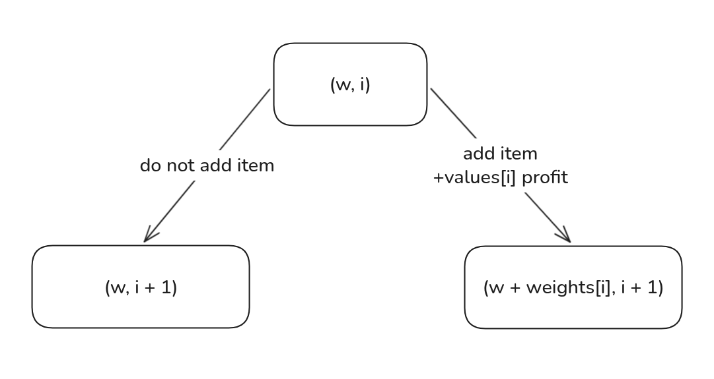

import Callout from '@/components/Callout.astro'

<Callout title="Problem Statement" variant="proposition">
  You are a thief planning to rob a store. However, you can only carry a knapsack with a maximum capacity of `k` units.
  Each item `i` in the store has a weight `weights[i]` and a value `values[i]`.

  Find the maximum total value of items you can carry in your knapsack.
</Callout>

Ah, the knapsack problem… this one was the first to make me want to pull my hair out in frustration.
I spent about two days watching videos on YouTube and reading tutorials, but none of them helped me understand the
solution in an intuitive way.

Maybe I’m missing some prerequisite knowledge needed to understand their explanations. But if that’s the case,
I can’t even move forward, since I don’t know what that hidden piece of information is.

So I decided to ignore everything and try to adapt the solution to the knowledge and methods I already have.
The following text is the result.

## State Graph Interpretation
We are talking about dynamic programming, so we can represent this problem using a directed acyclic graph (DAG).
Let's first understand what information we have until now...

The “0/1” in the name of this problem means that it is a type of dynamic programming (DP) problem in which evaluating
each item in the input leads to two possible cases: the item either influences the answer to the subproblem or it does
not. In other words, for each available item in the store, we can either **put it in the knapsack** or **leave it out of the knapsack**.

From this information, we can conclude that **we need the index of the items** so that we can keep track of which items we
are adding to the knapsack.

Another variable we should pay attention to is the **accumulated weight in the knapsack**, since the problem states that we
cannot exceed the maximum value of k.

So our state can be composed of the item index and the accumulated weight:

State (what the result depends on):
  - **w**: the accumulated weight
  - **i**: the item index

Edges (possible actions):
  - 1. **Add** the item `i` to the knapsack
  - 2. **Do not add** the item `i` to the knapsack



#### General Graph


## Defining the DP state
Now that we have the variables that we want to track and the actions that we can apply on them. We now must formalize
what we want to find.

We have already decided that `w` represents the accumulated weight and `i` is the index of the item we are evaluating.
Therefore, we have a 2D dynamic programming problem, and our state can be represented by a matrix.

Each cell `dp[w][i]` in this matrix stores the answer to the subproblem identified by the combination of the values `w` and `i`. This is:

```python
dp[w][i] = "The maximum profit possible starting with the accumulated weight W and the item I"
```

As always, we can extract some important information from this definition:
1. Each value stored in the subproblem identified by `dp[w][i]` represents the maximum profit we can achieve from the
starting point `(w, i)` to the final point `(k, n - 1)`, where `k` is the weight capacity and `n - 1` is the index of the last item.
2. The answer we are searching for is given by the subproblem `dp[0][0]`. In other words: **“What is the maximum profit
achievable starting with an accumulated weight of zero and without having evaluated any items yet?”**

## Deriving the recurrence relation
Now it's time to use our knowledge about the edges of our state graph, the actions that we can apply to our state.
From a given state `dp[w][i]`, we have two possible options:

#### 1. Add the item `i` to the knapsack
If we add item `i` to the knapsack, the profit we can achieve is the value of the item `i` plus the profit of the evaluation of the next items.
This can be represented by:
```python
dp[w][i] = values[i] + dp[w + weights[i]][i + 1]

# dp[w + weights[i]][i + 1] represents a knapsack with the item "i" already added
# The new index "w" will be the current weight plus the weight of the item "i"
# The new index "i" will be the index of the next item
```

#### 2. Do not add the item `i` to the knapsack
If we don't add item `i` to the knapsack, the profit we can achieve is simply the profit of the evaluation of the next items.
This can be represented by:
```python
dp[w][i] = dp[w][i + 1]

# The index "w" will be the same, since we did not add a new item
# The new index "i" will be the index of the next item
```

We must remember now that what we want is the maximum profit from these two possible action at each subproblem `dp[w][i]`.
This leads us to the recurrence relation:

```python
dp[w][i] = max(
    values[i] + dp[w + weights[i]][i + 1],
    dp[w][i + 1]
)
```

### Base cases
<Callout title="Reverse tabulation" variant="important">
  Our recursive relation depends on indices ahead of `i` and `w`, because of that, **we need to fill our tabulation matrix backwards**.
</Callout>
Thinking about the base cases of this problem, we can identify to possible scenarios:

#### When i >= n (There is no item left to evaluate)
At this point, we have already evaluated all items in the store, there is no additional profit to be made.
```python
dp[w][i] = 0 # for every i >= n
```

#### When w > k (the knapsack is full)
In this scenario, any added weight will exceed the knapsack capacity, so it's not possible to make any additional profit.
```python
dp[w][i] = 0 # for every w > k
```

## Implementation
This is our final implementation of the 0/1 knapsack problem using dynamic programming with tabulation:
```python title="unique_pathways.py" caption="0/1 knapsack implementation" showLineNumbers
def knapsack(k: int, weights: List[int], values: List[int]) -> int:
    n = len(weights)

    # rows: accumulated weight | added 1 so the weight k is also valid
    # columns: item index | added 1 so the expression dp[w][i + 1] is also valid
    dp = [[0] * (n + 1) for _ in range(k + 1)]

    # dp[w][i] -> max profit possible starting with accumulated weight w at item i
    # w -> accumulated weight
    # i -> item index
    # dp[w][i] = max(
    #   dp[w][i + 1],   -> do nothing, no weight is added and I advance to the next item
    #   dp[w + weight[i]][i + 1] + value[i] -> add current item to the knapsack
    # )

    # Base cases (all cells are already zero, we dont need to implement):
    # 1. dp[w][i] = 0 for every i > n | no items (profit) left to add
    # 2. dp[w][i] = 0 for every w > k | no weight (profit) left to add

    # traverse items in reverse
    for i in range(n - 1, -1, -1):
        weight = weights[i]
        value = values[i]
        # traverse possible weights in reverse
        for w in range(k, -1, -1):
            if w + weight <= k: # prevents index out of
                # apply recurrence formula
                dp[w][i] = max(
                    dp[w][i + 1],
                    dp[w + weight][i + 1] + value
                )
    # return the max profit starting with zero weight and zero items
    return dp[0][0]
```