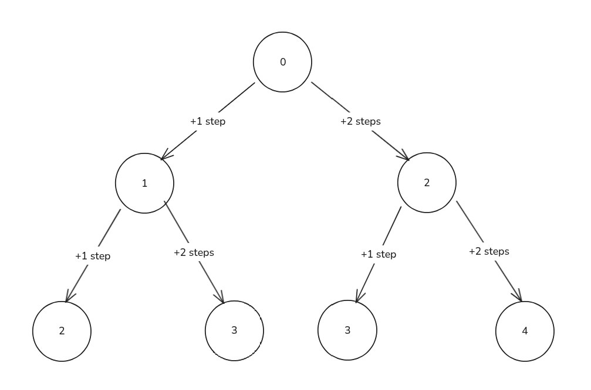
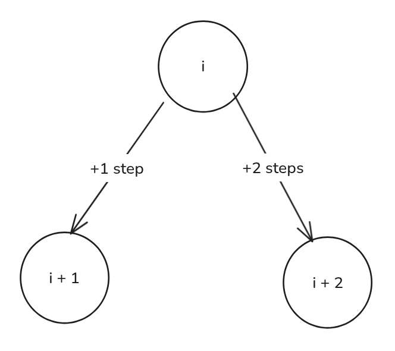

import Callout from '@/components/Callout.astro'

<Callout title="Problem Statement" variant="proposition">
  You are climbing a staircase. It takes `n` steps to reach the top.
  Each time you can either climb `1` or `2` steps. In how many distinct ways can you climb to the top?
</Callout>

## State Graph Interpretation
For this problem, we can represent the number of ways to climb to the top as a state graph.
Let's draw the state graph for `n = 5 (0-indexed)`:


This is our Directed Acyclic Graph (DAG) representation of the problem.
The value on each node represents our state (the current step),
and the edges represent the possible transitions (climbing 1 or 2 steps).

## Defining the DP state
<div class="max-w-md mx-auto">
  
</div>
Defining a DP state consists in understanding and formalizing what we are trying to compute at each step of
our state graph. In this case, it is already clear in the problem statement, we want "The number of distinct ways to climb to the top".
So we can define our DP state as follows:

```
dp[i] = The number of distinct ways to climb from step i to the top (step n)
```

From this definition we can extract two important pieces of information:
1. Each state **dp[i]** represents the number of ways to climb from step i to the top.
2. Our final answer will be **dp[0]**, since we start climbing from step 0.

## Deriving the recurrence relation
Here is were we must have our hability to read DAGs come into play.
We need to look at our state graph and understand how the states are connected to each other.
From the graph, we can see that to get to the top from step `i`, we can either:
1. Climb 1 step to reach step `i + 1`, and then climb from step `i + 1` to the top, which contributes `dp[i + 1]` ways.
2. Climb 2 steps to reach step `i + 2`, and then climb from step `i + 2` to the top, which contributes `dp[i + 2]` ways.
Therefore, we can derive the following recurrence relation:

```python
# number of paths from a node = sum of paths from its children
dp[i] = dp[i + 1] + dp[i + 2]
```

## Base cases
<Callout title="Reverse tabulation" variant="important">
  Our recursive relation depends on indices ahead of `i`, because of that, **we need to fill our tabulation array backwards**.
</Callout>
To fill our tabulation array, we need to define our base cases at the end of the array. Let's analyze the last few nodes of our state graph to find these base cases:

#### When i = n (the top step):
For `dp[n]`, we are already at the top step, so there is exactly 1 way to be at the top step, which is to already be there. Therefore:
```
`dp[n] = 1`
```

#### When i > n (steps beyond the top):
For `dp[i]` where `i > n`, we are beyond the top step, which means there are no ways to climb to the top from these steps. Therefore:
```
dp[i] = 0 for all i > n
```

## Implementation
And here we can finally implement our solution using tabulation:

```python title="climbing_stairs.py" caption="Climbing Stairs with tabulation" showLineNumbers
def climbStairs(n: int) -> int:
    # dp[i] = number of ways to go from step i to step n
    dp = [0] * (n + 2)   # +2 so dp[n+1] and dp[i+2] are always valid

    # Base cases (terminal nodes)
    dp[n] = 1 # already at the goal
    dp[n + 1] = 0 # past the goal

    # Evaluate nodes in reverse topological order
    for i in range(n - 1, -1, -1):
        dp[i] = dp[i + 1] + dp[i + 2]

    # after filling the dp array, we want the number of ways
    # to reach n starting from zero
    return dp[0]
```