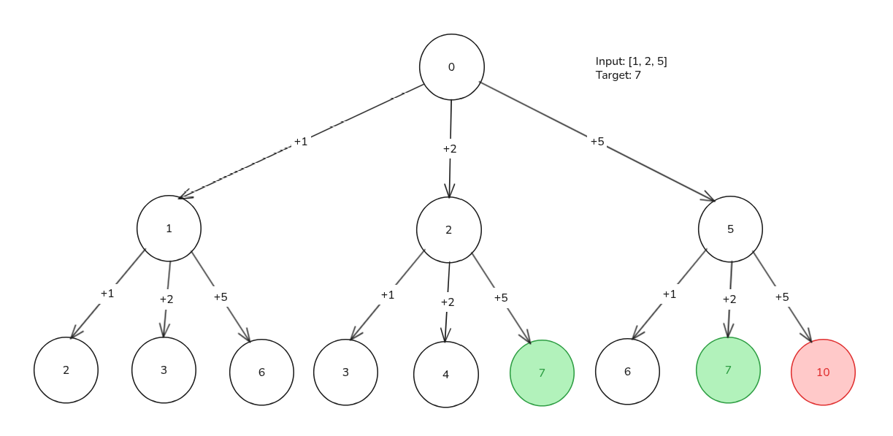
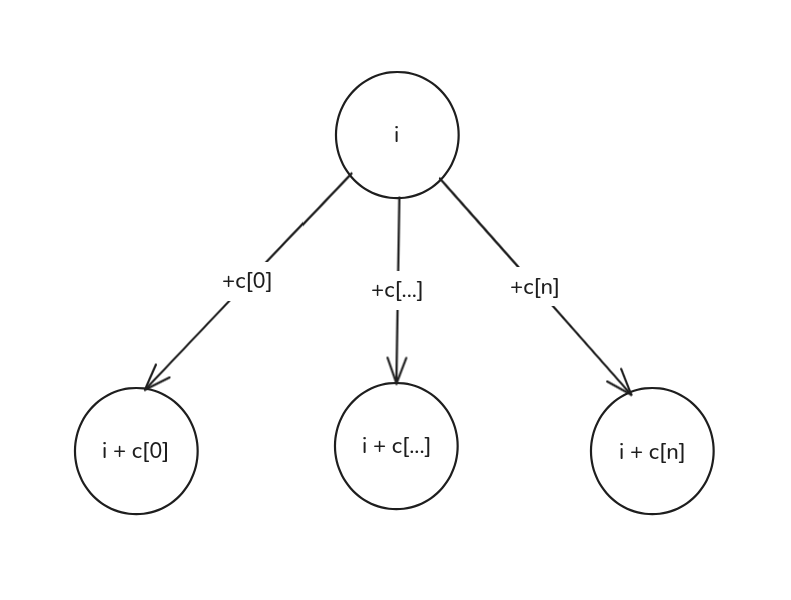

import Callout from '@/components/Callout.astro'

<Callout title="Problem Statement" variant="proposition">
  You are given an integer array `coins` representing coins of different denominations and an integer `amount` representing
  a total amount of money.

  Return the **fewest number of coins that you need to make up that amount**. If that amount of money cannot be made up
  by any combination of the coins, return `-1`.

  *You may assume that you have an infinite number of each kind of coin.*
</Callout>

## State Graph Interpretation
In this problem, we can represent the number of ways to make up the amount as a state graph.
Let's draw the state graph for `coins = [1, 2, 5]` and `amount = 7`.



In this graph, each node value represents the accumulated amount of money,
and the edges represent the possible transitions (adding a coin of a certain value).

## Defining the DP state
<div class="max-w-md mx-auto">
  
</div>

Usually, the DP state is defined as the answer to a subproblem.
In this case, we can define our DP state as follows:

```
dp[i] = The fewest number of coins needed to go from amount i to the target amount
```
From this definition we can extract two important pieces of information:
1. Each state **dp[i]** represents the fewest number of coins needed to go from amount i to the target amount.
2. Our final answer will be **dp[0]**, since we start from amount 0 and want to reach the target amount.

## Deriving the recurrence relation
From a given state (accumulated amount) `i` we can add any of the coins `c` to reach a new state (new accumulated amount) `i + c`.
If we take a coin `c`, we spend this one coin plus the fewest number of coins needed to go from the new state `i + c` to the target amount, which is `dp[i + c]`.

So, the total cost of taking the coin `c` is:
```
1 + dp[i + c]
```

But, we want the best option of all choices, so we need to take the minimum of all these options.
```
dp[i] = min over all coins c of (1 + dp[i + c])
```

Therefore, we can derive the following recurrence relation:
```python
# number of coins from a node = 1 (the coin we take) + min of number of coins from its children
dp[i] = 1 + min(dp[i + coin[0]], ..., dp[i + coin[n]])
```

## Base cases
<Callout title="Reverse tabulation" variant="important">
  Our recursive relation depends on indices ahead of `i`, because of that, **we need to fill our tabulation array backwards**.
</Callout>
To fill our tabulation array, we need to define our base cases at the end of the array. Let's analyze the last few nodes of our state graph to find these base cases:

#### When i = n (we have reached the target amount):
For `dp[n]`, we are already at the target amount, so there is exactly 0 coins needed to reach the target amount. Therefore:
```python
dp[n] = 0
```

## Implementation
And here we can finally implement our solution using tabulation:

```python title="climbing_stairs.py" caption="Climbing Stairs with tabulation" showLineNumbers
def coinChange(self, coins: List[int], amount: int) -> int:
    # 1. start every state with infinity coins needed, because we haven't calculated the answer for these states yet
    # 2. we need amount + 1 states because we want the index 'amount' to be valid
    dp = [float("inf")] * (amount + 1)

    # i = accumulated amount
    # dp[i] minimum number of coins needed to go from i to the target
    # base case: if i already have the target amount
    # the number of coins needed is zero
    dp[amount] = 0

    for i in range(amount - 1, -1, -1):
        for coin in coins:
            if (i + coin) <= amount: # prevents index out of bounds
                dp[i] = min(dp[i], 1 + dp[i + coin])

    return dp[0] if dp[0] != float("inf") else -1
```