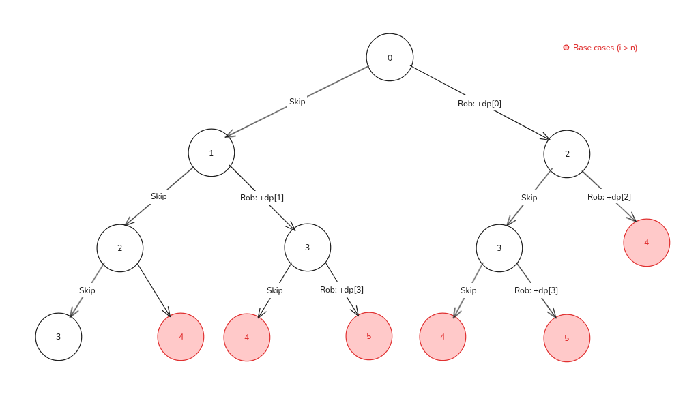

import Callout from '@/components/Callout.astro'

<Callout title="Problem Statement" variant="proposition">
  You are a professional robber planning to rob houses along a street. Each house has a certain amount of money stashed,
  the only constraint stopping you from robbing each of them is that adjacent houses have security systems connected
  and **it will automatically contact the police if two adjacent houses were broken into on the same night**.

  Given an integer array `nums` representing the amount of money of each house,
  return _the maximum amount of money you can rob tonight **without alerting the police**_.
</Callout>

## State Graph Interpretation
We can model this problem as a **state graph**, where the *nodes (states) represent the index of the house we are
currently considering* and the *edges (transitions) represent the decision we make at that house*.

Let the houses be:

```python
nums = [1, 2, 3, 1]
```

Each state can be represented using `i`, where `i` being the index of the house where we are.
From house `i`, we have two choices:
1. **Skip house i** → just go to `i + 1`
2. **Rob house i** → collect `nums[i]` and skip the next house, going to `i + 2`

So the transitions (edges) are:
```python
i -> i + 1 # skip current house
i -> i + 2 # rob current house
```

This produces a Directed Acyclic Graph, but now edges have _weights_:
- skip edge → weight 0
- rob edge → weight = nums[i]

Let's draw the state graph for `nums = [1, 2, 3, 1]`:


## Defining the DP state
For this problem we define our DP state as:
```python
dp[i] = maximum amount of money we can rob starting from house i
```
From this definition we can extract two important pieces of information:
1. Each state **dp[i]** represents the maximum amount of money we can rob starting from house i.
2. Our final answer will be **dp[0]**, since we start from the first house and want to maximize the amount of money we can rob from there.

## Deriving the recurrence relation
From each house `i`, we have two options:

- **Option 1 - Skip house i:** If we do that, we must got the max profit of `dp[i + 1]`
- **Option 2 - Rob house i:** If we do that, we can get the profit composed of the amount in the current house plus the max profit of the house after the next one. That is `nums[i] + dp[i + 2]`

But we want the better of the two, so our recursive relation can be:
```python
dp[i] = max(dp[i + 1], nums[i] + dp[i + 2])
```

## Base cases
<Callout title="Reverse tabulation" variant="important">
  Our recursive relation depends on indices ahead of `i`, because of that, **we need to fill our tabulation array backwards**.
</Callout>
To fill our tabulation array, we need to define our base cases at the end of the array.
Let's analyze the last few nodes of our state graph to find these base cases:

#### 1. When i >= n (we are beyond the last house)
At this point, we are beyond the last house, so there are no more houses to rob, and the maximum amount of money we can rob is 0.
```python
dp[n] = 0
dp[n + 1] = 0
```

## Implementation
And here is our solution using tabulation:
```python title="house_robber.py" caption="House Robber with tabulation" showLineNumbers
def rob(nums):
    n = len(nums)

    # dp[i] = maximum money we can rob starting from house i
    dp = [0] * (n + 2)  # +2 so dp[i+1] and dp[i+2] are always valid

    # Base cases:
    dp[n] = 0
    dp[n + 1] = 0

    for i in range(n - 1, -1, -1):
        dp[i] = max(dp[i + 1], nums[i] + dp[i + 2])

    return dp[0]
```