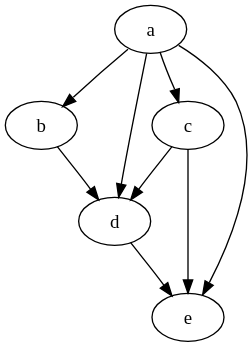

## Intro
This is a record of my effort to dominate the monster that is dynamic programming in DSA.
It’s my first time coming into contact with this kind of problem-solving technique, so this series of posts is all
about me searching for a “flash of comprehension” that can help me solve any of these problems…
and I think I’ve found something!

After solving a dozen problems and watching some not-so-helpful YouTube tutorials, I realized that most of them focus
only on solving specific and basic patterns, but avoid explaining what all these patterns have in common.
I guess I’ll have to fill this gap on my own. Here’s what I’ve found:

## Pre-requisites
Yes, there is some knowledge that you must have before starting to solve DP problems as a pro. Here are they:

#### DAGs (Directed Acyclic Graphs)
We need to know how to create and read DAGs (Directed Acyclic Graphs). Why? Because solving DP problems is all about
knowing how to navigate these graphs, they help us not only reach the solution,
but also better visualize the problem we’re trying to solve.

A DAG, or Directed Acyclic Graph, is basically a way to represent things as nodes connected by one-way arrows,
where the arrows show some kind of dependency or flow, and the key rule is that you can never start at a node and
follow the arrows to eventually come back to the same node (the graph must have no cycles).

<div class="max-w-xs mx-auto">
  
</div>


#### Tabulation
Tabulation is a dynamic programming technique where you solve a problem by building a table (usually an array or matrix)
from the bottom up, filling it with the answers to smaller subproblems until you reach the final solution.
I think the best example to illustrate this is Fibonacci sequence (each term is the sum of the two previous terms).

```python title="tabulation_fibonacci.py" caption="Fibonacci with tabulation" showLineNumbers
def fibonacci(n):
    # tabulation array - we use n + 1 cause we want the index n (the answer) to be valid
    dp = [0 for _ in range(n + 1)]

    # base cases - the easy and trivial ones
    dp[0] = 0
    dp[1] = 1

    # using the base cases to calculate the hard ones until we reach 'n'
    for i in range(2, n + 1):
        dp[i] = dp[i - 1] + dp[i - 2]

    # return the answer
    return dp[n]
```

#### Recursion
Recursion is a problem-solving technique where a function solves a problem by calling itself on smaller versions of the
same problem, until it reaches a simple case that can be answered directly (that is our base cases).
It’s like saying “to solve this, first solve an easier version of it,” and you keep doing that until the problem
becomes trivial, then all the answers stack back up to give you the final result.

Let's use Fibonacci as an example again:
```python title="recursion_fibonacci.py" caption="Fibonacci with recursion" showLineNumbers
def fibonacci(n):
    # base cases
    if n == 0:
        return 0
    if n == 1:
        return 1

    # Recursive case: sum of the two previous Fibonacci numbers
    return fibonacci(n - 1) + fibonacci(n - 2)
```

#### Memoization
Memoization is a dynamic programming technique where you speed up recursive solutions by storing the results of
problems you’ve already solved, so when the same input shows up again you can just reuse the answer instead of
recomputing it. In simple terms, it’s like giving your function a memory: the first time it solves something it writes
the result down, and next time it just looks it up, which can turn a slow exponential solution into a much faster one.

Fibonacci again, but using our "smart recursion":
```python title="memoization_fibonacci.py" caption="Fibonacci with memoization" showLineNumbers
def fibonacci(n, memo = {}):
    # if we already solve for n, return the answer for 'n'
    if n in memo:
        return memo[n]

    # base cases
    if n == 0:
        return 0
    if n == 1:
        return 1

    # solve and record the answer
    memo[n] = fibonacci(n - 1, memo) + fibonacci(n - 2, memo)
    # return the answer
    return memo[n]
```

That is it! These are our tools, let's start to use them... in the next posts.