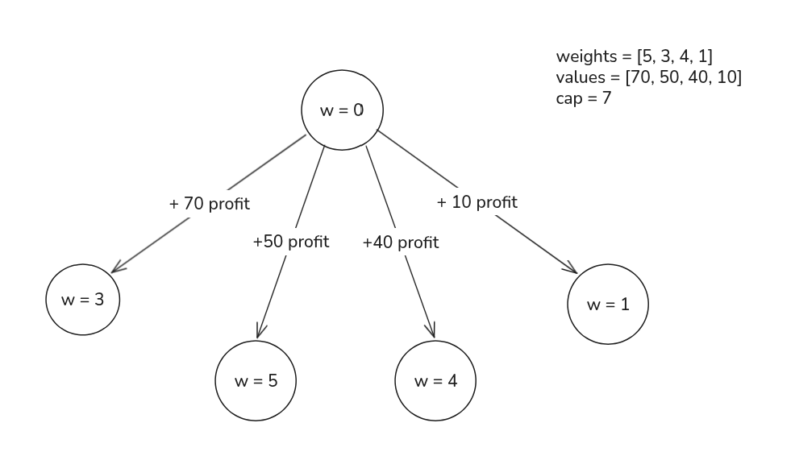

import Callout from '@/components/Callout.astro'

<Callout title="Problem Statement" variant="proposition">
  Given a knapsack with a fixed capacity `k` and a set of `n` items, where each item has an associated value `values[i]`
  and weight `weights[i]`, determine the maximum profit that can be obtained by filling the knapsack.
  Each item can be selected an unlimited number of times.
</Callout>

This one is a variation of the 0/1 Knapsack problem, where we can select each item multiple times.

The key to solving this problem is to recognize that we can use the same state graph as the 0/1 Knapsack, but with a slight modification.
Instead of having two edges for node (one for adding the item and one for not adding the item), we will have n edges for each node, where n is the number of items.
Each edge will represent adding a specific item to the knapsack.

## State Graph Interpretation
We can represent this problem using a directed acyclic graph (DAG) as well.
Since we need to keep track of the accumulated weight in the knapsack, we can use the same state variable `w` as in the 0/1 Knapsack problem.
Something that is also different is that we don't need to keep track of the item index, since we can add any item multiple times.
So our state can be composed of just the accumulated weight:

State (what the result depends on):
  - **w**: the accumulated weight

Edges (possible actions):
  - For each item `i`, we can **add** the item `i` to the knapsack.

Adding an item `i` to the knapsack will increase the accumulated weight by `weights[i]` and increase the profit by `values[i]`.

From this information, we can create the following state graph:



## Defining the DP state
Now that we have the variables that we want to track and the actions that we can apply on them. We now must formalize what we want to find.
We have already decided that `w` represents the accumulated weight. So we can define our DP state as follows:

```python
dp[w] = "the maximum profit that can be obtained starting with an accumulated weight of w"
```

From this definition, we can extract the following information:
1. Each state `dp[w]` represents the maximum profit that can be obtained starting with an accumulated weight of `w` until the maximum weight `k`.
2. The final answer will be `dp[0]`, since we want to find the maximum profit that can be obtained starting with an accumulated weight of `0` (i.e., an empty knapsack).

## Deriving the recurrence relation
Now that we have defined our DP state, we can derive the recurrence relation for it.
Since we can add any item multiple times, we can add any item `i` to the knapsack as long as it does not exceed the maximum weight `k`.

Adding an item `i` to the knapsack will increase the accumulated weight by `weights[i]` and increase the profit by `values[i]`.

But we must remember that we want to find the maximum profit, so we need to consider all possible items that we can add to the knapsack and take the maximum profit among them.
This leads us to the following recurrence relation:

```python
dp[w] = max(
  dp[w + weights[0]] + values[i],    # add item 0 to the knapsack
  dp[w + weights[1]] + values[i],    # add item 1 to the knapsack
  ...
  dp[w + weights[n - 1]] + values[i] # add item n to the knapsack
)
```

## Base cases
<Callout title="Reverse tabulation" variant="important">
  Our recursive relation depends on indices ahead of `w`, because of that, **we need to fill our tabulation array backwards**.
</Callout>
The base case for this problem is when the accumulated weight `w` exceeds the maximum weight `k`.
In this case, we cannot add any more items to the knapsack, so the profit is `0`.

```python
dp[w] = 0 # for every w > k
```

## Implementation
This is our final implementation of the unbounded knapsack problem using dynamic programming with tabulation:
```python title="unique_pathways.py" caption="0/1 knapsack implementation" showLineNumbers
def unbounded_knapsack(k: int, weights: List[int], values: List[int]) -> int:
    n = len(weights)
    # w: accumulated weight - added 1 so the weight k is also valid
    dp = [0] * (k + 1)

    # dp[w] -> max profit possible starting with accumulated weight w
    # dp[w] = max(
    #   dp[w_0] -> add item 0 to the knapsack, w_0 = w + weight[0]
    #   dp[w_1] -> add item 1 to the knapsack, w_1 = w + weight[1]
    #   ...
    #   dp[w_n] -> add item n to the knapsack, w_n = w + weight[n]
    # )

    # Base cases:
    # 1. dp[w] = 0 for every w > n | no items (profit) left to add

    for w in range(k, -1, -1):
        best = 0
        for i in range(n - 1, -1, -1):
            if w + weights[i] <= k: # prevents index out of bounds
                best = max(best, dp[w + weights[i]] + values[i])
        dp[w] = best

    return dp[0] # return the max profit starting with zero weight and zero items
```