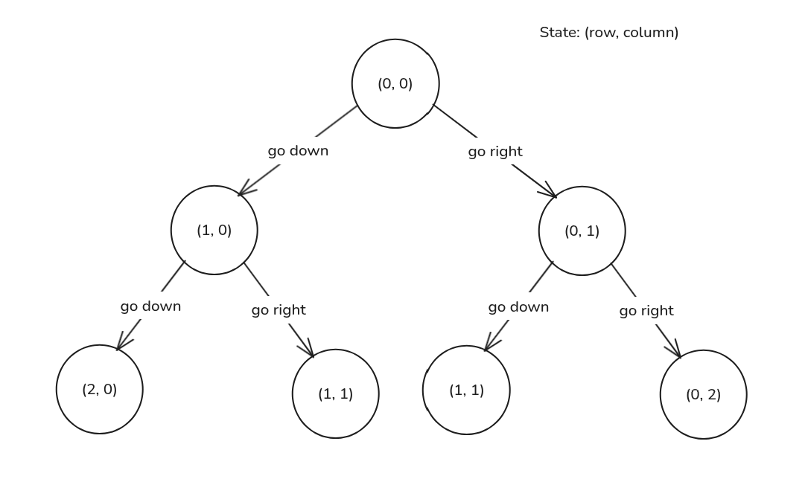

import Callout from '@/components/Callout.astro'

<Callout title="Problem Statement" variant="proposition">
  You are given two integers `m` and `n`, representing a grid of size `m x n`.
  You start at the top-left cell `(0, 0)` and want to reach the bottom-right cell `(m-1, n-1)`.
  _At each step, you can only move either **right** or **down**._

  _Return the number of unique paths from start to finish._
</Callout>

## State Graph Interpretation
Ok. Let's start to think about a state graph to represent this problem.
Since we are working on a grid, we will need a state composed of two variables: the row and the column of the cell we are currently in.
So, we can represent each state as a tuple `(i, j)`, where `i` is the row index and `j` is the column index.
From each cell `(i, j)`, we have two possible transitions:
1. Move right → transition to `(i, j + 1)`
2. Move down → transition to `(i + 1, j)`

This produces a Directed Acyclic Graph:



## Defining the DP state
From the problem statement, we want to find the number of unique paths from the top-left cell `(0, 0)` to the bottom-right cell `(m-1, n-1)`.
Let's reduce this problem to a subproblem: what if we want to find the number of unique paths from a cell `(i, j)` to the bottom-right cell `(m-1, n-1)`?
If we can solve this subproblem, we can easily solve the original problem by just finding the number of unique paths from the starting cell `(0, 0)` to the target cell `(m-1, n-1)`.
So, we can define our DP state as follows:
```
dp[i][j] = The number of unique paths from cell (i, j) to cell (m-1, n-1)
```
From this definition we can extract two important pieces of information:
1. Each state **dp[i][j]** represents the number of unique paths from cell `(i, j)` to cell `(m-1, n-1)`.
2. Our final answer will be **dp[0][0]**, since we start from the top-left cell `(0, 0)` and want to reach the bottom-right cell `(m-1, n-1)`.

## Deriving the recurrence relation
From a given cell `(i, j)`, we can move either right or down.
- If we move right, we transition to cell `(i, j + 1)`, and the number of unique paths from there to the target cell is `dp[i][j + 1]`.
- If we move down, we transition to cell `(i + 1, j)`, and the number of unique paths from there to the target cell is `dp[i + 1][j]`.
Since these two options are mutually exclusive (we can only move in one direction at a time), the total number of unique paths from cell `(i, j)` to the target cell is the sum of the unique paths from both options:
```
dp[i][j] = dp[i][j + 1] + dp[i + 1][j]
```

## Base cases
<Callout title="Reverse tabulation" variant="important">
  Our recursive relation depends on indices ahead of `i`, because of that, **we need to fill our tabulation array backwards**.
</Callout>
To fill our tabulation array, we need to define our base cases at the end of the array.
Let's analyze the last few nodes of our state graph to find these base cases:

1. When `(i, j) == (m - 1, n - 1)` (we are in the last cell)
At this point, we are already in the target cell, so there is only one unique path from this cell to itself, which is to stay there:
```python
dp[m - 1][n - 1] = 1
```

2. When `(i, j) >= (m, n)`  (we are outside the grid)
These are invalid states, so there are no unique paths from these cells to the target cell:
```python
dp[i][j] = 0 # for i >= m or j >= n
```

## Implementation
This is our final implementation of the Unique Pathways problem using dynamic programming with tabulation:
```python title="unique_pathways.py" caption="Unique Pathways implementation" showLineNumbers
    def uniquePaths(self, m: int, n: int) -> int:
        # we add on extra row and column
        # So dp[i + 1] and dp[j + 1] can always be valid
        dp = [[0] * (n + 1) for _ in range(m + 1)]

        # final cell, we are already at the target
        dp[m - 1][n - 1] = 1

        for i in range(m - 1, -1, -1):
            for j in range(n - 1, -1, -1):
                # skip the final cell, we already filled it
                if i == m - 1 and j == n - 1:
                    continue
                dp[i][j] = dp[i + 1][j] + dp[i][j + 1]

        return dp[0][0]
```