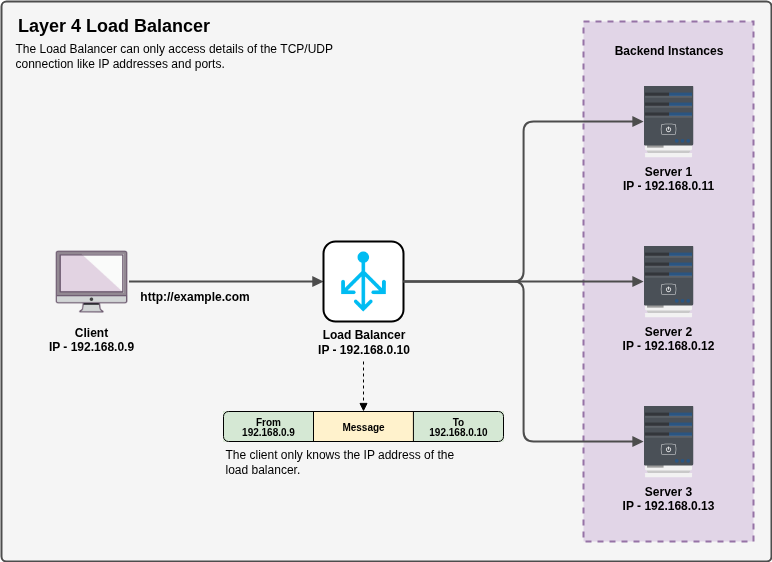
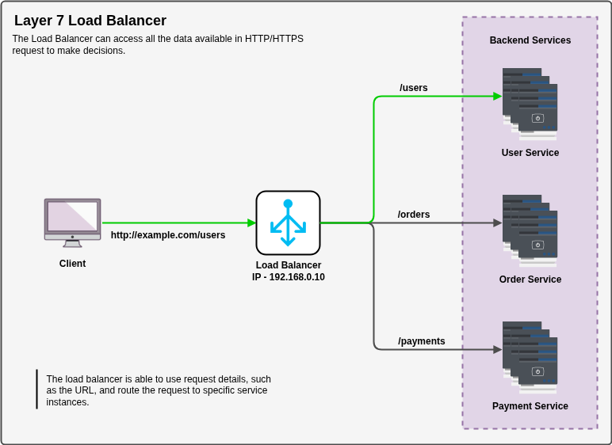
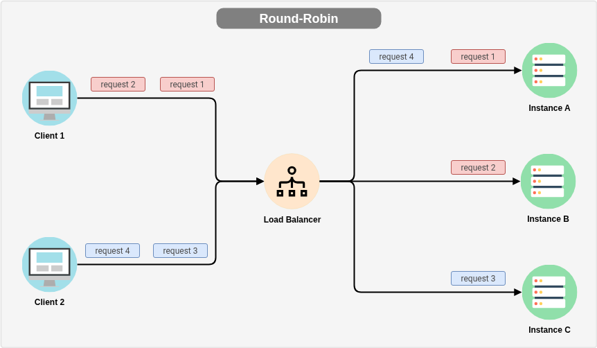
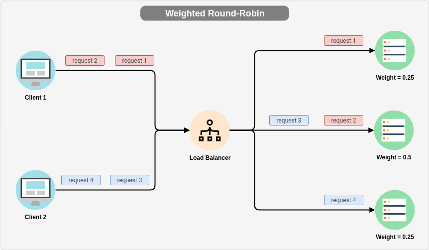
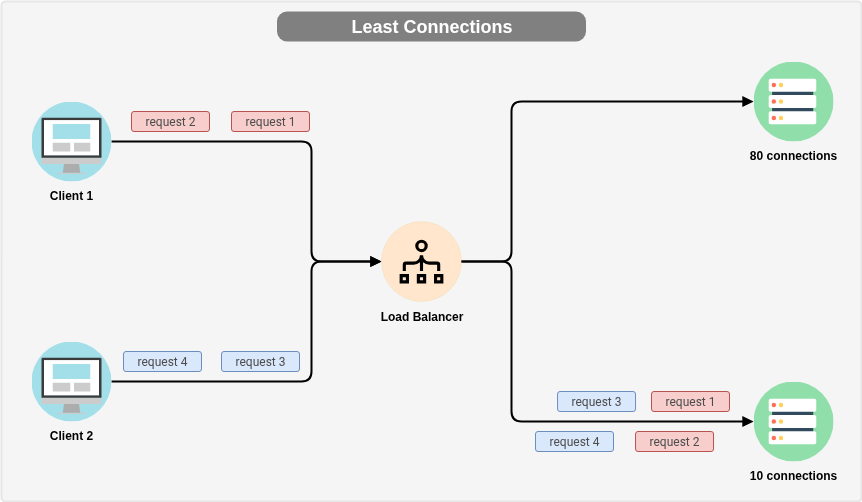
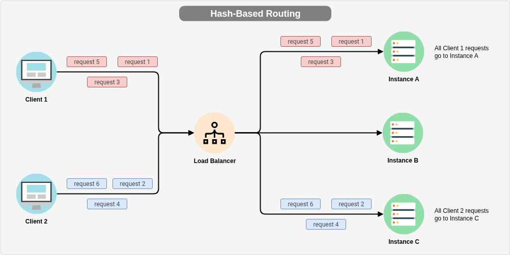

import Callout from '@/components/Callout.astro'

## What is a Load Balancer?
A load balancer is a software or hardware device that allows us to distribute network traffic across multiple servers, instances or computing resources.
Instead of allowing all incoming traffic to hit single machine, the load balancer sits in front of your infrastructure and acts as a traffic controller.

The main goal of a load balancer is to ensure that no single server becomes overwhelmed with too much traffic,
which can lead to slow performance or even downtime.
By distributing the traffic evenly, load balancers help improve the overall performance and reliability of applications and services.

## Types of Load Balancers
Load balancers are commonly categorized based on the layer of the OSI (Open Systems Interconnection) model at which they operate.
The two primary categories are:
- Layer 4 (L4) Load Balancers
- Layer 7 (L7) Load Balancers

The difference between them lies in how much of the network request they inspect and what information they use to make routing decisions.

Layer 4 load balancers operate at the transport layer of the OSI model.
They make routing decisions based on network-level information such as IP addresses, TCP ports, and UDP ports.

Layer 7 load balancers operate at the application layer of the OSI model.
They can inspect the actual content of the request—such as HTTP headers, cookies, hostnames, and URL paths.
This allows them to make more intelligent routing decisions based on the specific characteristics of the request.

## L4 Load Balancers
Layer 4 load balancers, often referred to as network load balancers, function at the transport layer.
They examine packet headers to determine the source IP address, destination IP address, source port, and destination port.
Based on this information, they forward traffic to an appropriate backend server.

Because L4 load balancers do not inspect the application payload (such as the contents of an HTTP request), they operate with minimal overhead.

Due to their performance characteristics, L4 load balancers are commonly used in scenarios where speed and scalability are critical.
Typical use cases include gaming servers, real-time communication systems (such as VoIP or messaging platforms), streaming services,
and financial systems like high-frequency trading platforms, where even small delays can have significant impact.

<Callout title="" variant="note">
  Since the L4 load balancer cannot inspect the application-level data,
  its main goal is to **distribute network TCP/UDP connections**.
</Callout>

## L7 Load Balancers
Layer 7 load balancers are also known as application load balancers.
They operate at the application layer of the OSI model.
Unlike Layer 4 load balancers, which rely only on IP addresses and ports, L7 load balancers analyze the actual content
of the request before making a routing decision.

Because they understand the structure of protocols like HTTP and HTTPS, they can apply more granular and context-aware routing rules.

For example, an L7 load balancer can route requests for /api/* to one group of servers and requests for /images/* to another.
It can also direct traffic based on specific headers (such as User-Agent), cookies for session persistence, or even the
requested domain name in multi-tenant environments.

This deeper inspection enables much more sophisticated traffic management strategies.
L7 load balancers can support features such as path-based routing, host-based routing, SSL/TLS termination,
authentication integration, rate limiting, and sometimes even basic web application firewall (WAF) capabilities.

<Callout title="" variant="note">
  The L7 load balancer can inspect the application-level data, so it can make routing decisions based on the content of the traffic.
  This allows it to **distribute network HTTP/HTTPS requests** based on the content of the traffic,
  such as directing requests to specific servers based on the URL path or HTTP headers.
</Callout>

## Load Balancing Algorithms
To distribute the traffic across multiple servers, load balancers use different algorithms to determine how to route the incoming traffic.
Some of the most common load balancing algorithms include:

#### Round-Robin
In the round-robin algorithm, the load balancer distributes incoming traffic evenly across all available servers in a cyclic manner.
For example, if there are three servers (A, B, and C), the load balancer will route the first request to server A,
the second request to server B, the third request to server C, and then repeat the cycle for subsequent requests.

#### Weighted Round-Robin
In the weighted round-robin algorithm, the load balancer assigns a weight to each server based on its capacity or performance.
The load balancer then distributes incoming traffic based on the assigned weights, with servers that have higher weights
receiving more traffic than those with lower weights.

For example, if server A has a weight of 3, server B has a weight of 2, and server C has a weight of 1,
the load balancer will route three requests to server A, two requests to server B, and one request to server C in each cycle.

#### Least Connections
In the least connections algorithm, the load balancer routes incoming traffic to the server with the fewest active connections.
This algorithm is based on the idea that the server with the fewest active connections is likely to be the least loaded and can handle more traffic.

#### Weighted Least Connections
In the weighted least connections algorithm, the load balancer assigns a weight to each server based on its capacity or performance,
and then routes incoming traffic to the server with the fewest active connections, taking into account the assigned weights.
This algorithm is similar to the least connections algorithm, but it also considers the capacity of each server when making routing decisions.

#### IP Hash
In the IP hash algorithm, the load balancer routes incoming traffic to servers based on a hash of the client's IP address.
This algorithm is often used to ensure that a client is consistently routed to the same server, which can be useful for
applications that require session persistence or sticky sessions.

#### Random
In the random algorithm, the load balancer routes incoming traffic to servers randomly.
This algorithm is simple and can be effective in certain scenarios, but it does not take into account the current load
or capacity of the servers, which can lead to uneven distribution of traffic and potential performance issues.

#### Least Response Time
In the least response time algorithm, the load balancer routes incoming traffic to the server that has the lowest average response time.
This algorithm is based on the idea that the server with the lowest average response time is likely to be the least loaded and can handle more traffic.

