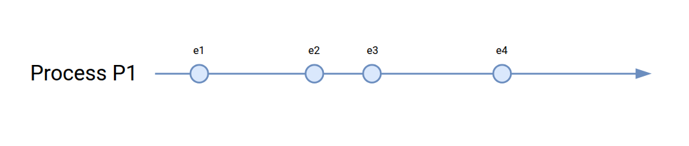
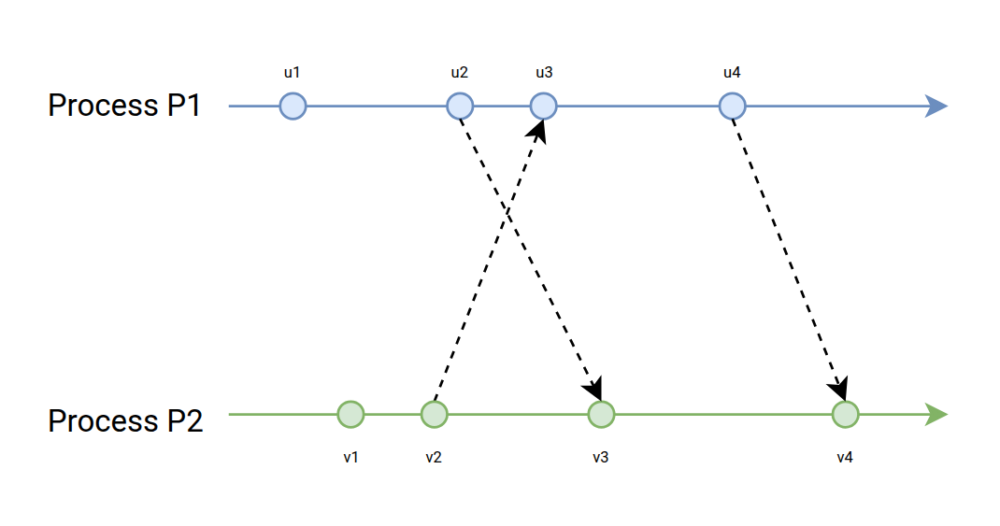
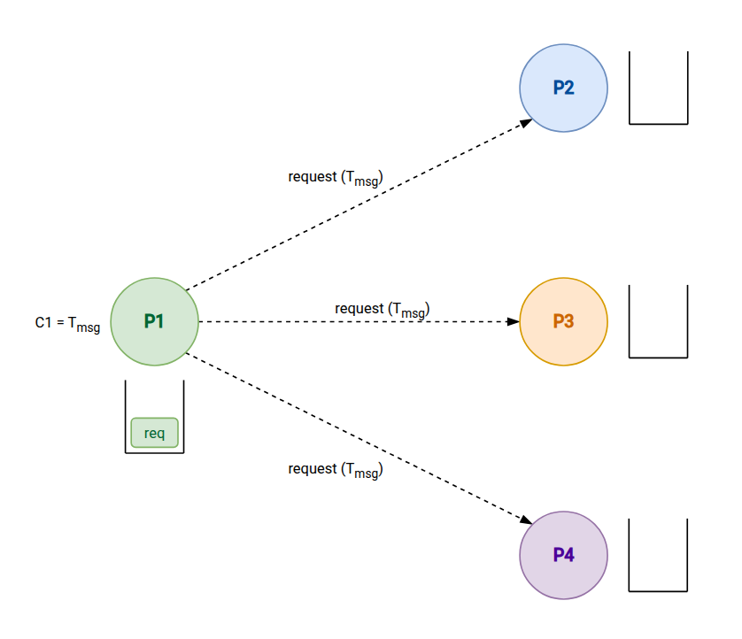
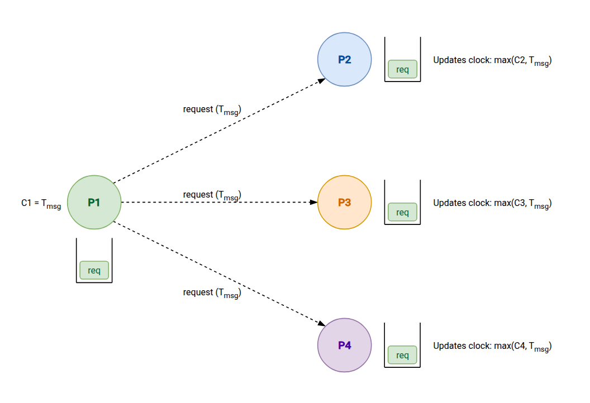
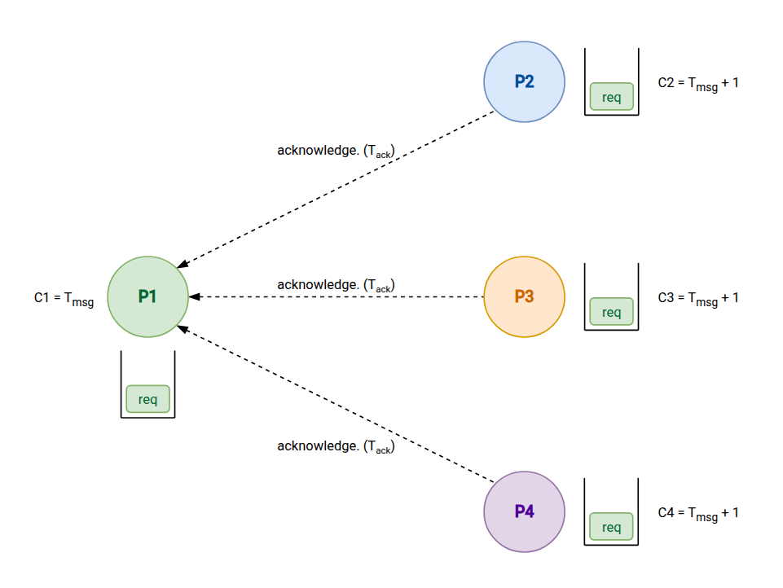
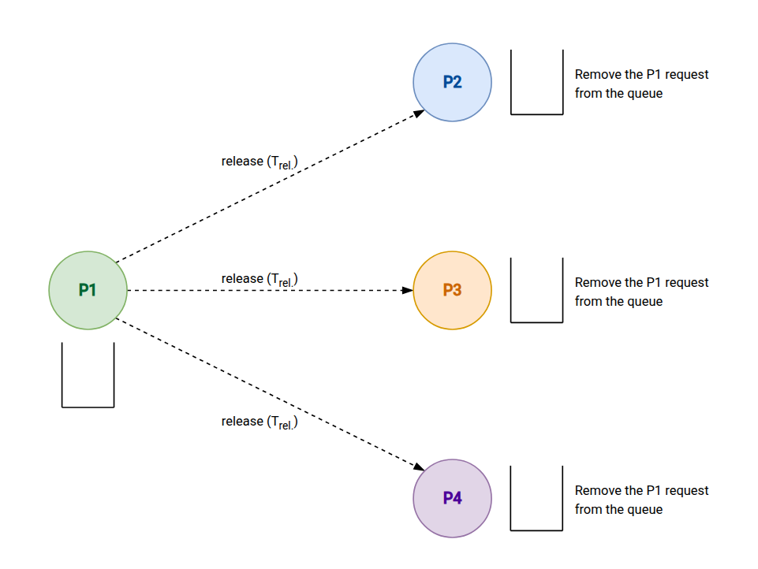

import Callout from '@/components/Callout.astro'

## Introduction
In 1978, **Leslie Lamport** published a paper called **Time, Clocks, and the Ordering of Events in a Distributed System**.

His goal was to introduce a simple algorithm for reasoning about the order of events in distributed systems, where there’s no single,
shared clock keeping everything in sync.

That might sound abstract, but it’s actually a very real problem. In distributed systems, understanding _what happened before what_ is surprisingly tricky,
and getting it wrong can lead to all sorts of subtle bugs.

When researching this topic, I found Lamport's original work; it is a fundamental piece of writing regarding the subject matter however it can also be
difficult to understand at times.

So in the following sections, I will attempt to explain the details with clarity. I will state up front, that some aspects of explaining logical
clocks cannot avoid being mathematical because they are so central to the concept. However, my intention is to make the explanation of them as easily
understandable as possible.

With that said, let’s get into it.

## The "Happened Before" Relation
The first idea we need to get comfortable with is what it actually means when we say that an event **A _happened before_ B**.
But instead of jumping straight into definitions, it helps to picture a simple scenario.

In computing, we often talk about _processes_. You can think of a process as just a sequence of tasks that need to run in a specific order.
Each one of those tasks is what we’ll call an _event_. So a process is basically a chain of events happening one after another.

>The time advances from the left to the right and each node is the occurrence of an event.

Now, things get more interesting with distributed systems. Instead of a single process, we have multiple processes running at the same time,
each with its own sequence of events. They can also communicate with each other by sending messages, which creates dependencies between events in different processes.

**You don't need to give too much focus on these diagrams, they are just a auxiliary tool to help us visualize what we are discussing here.**

Now that we have processes and events in mind, let’s talk about the concept of _“happened before”_.

---

Inside a single process, this idea of causality between two events is pretty straightforward. The order is already defined.
If a process $P$ says event _A_ comes before event _B_,
then there’s no ambiguity: **A happened before B**.

<Callout title={"Local events"} variant={"definition"}>
  If _A_ and _B_ are events in the same process and **A comes before B**, then:
  $$
  A → B
  $$
</Callout>

Simple enough.

Now let’s bring multiple processes into the picture. Imagine two processes, $P_1$ and $P_2$, that can communicate.
Say event _A_ is **“$P_1$ sends a message”** and event _B_ is **“$P_2$ receives that message.”**

Even though they’re in different processes, there’s still a clear relationship: **the message has to be sent before it can be received.**

<Callout title={"Message passing"} variant={"definition"}>
  If _A_ is the sending of a message and _B_ is the receipt of that same message, then:
  $$
  A → B
  $$
</Callout>

So far, so good.

There’s also an important property that makes this whole idea useful: **transitivity**. In plain terms, it just means that order “chains together.”

If _A_ happened before _B_, and _B_ happened before _C_… then yeah, _A_ definitely happened before _C_.

<Callout title={"Transitivity"} variant={"definition"}>
  If $A \to B$ and $B → C$, then:
  $$
  A → C
  $$
</Callout>

Finally, there’s one more case worth calling out. Sometimes, two events have no ordering at all. Neither one happened before the other.

This usually happens when events occur in different processes and there’s no communication linking them.

<Callout title={"Concurrency"} variant={"definition"}>
  If _A_ does not happen before _B_ and _B_ does not happen before _A_, then _A_ and _B_ are **concurrent**, this can be written as:
  $$
  (A \not\to B) \cap (B \not\to A) ⇒ A ∥ B
  $$
</Callout>

## Partial Ordering and Total Ordering
Now that we understand what “happened before” means, we can talk about how events are actually ordered in a distributed system.

The truth is: the definitions that we have made before are not able to provide us with a complete and global timeline of events. What we really have
is an example of a **partial order**.

Partial order means that _some_ events can be compared (we know one happened before the other), but others can’t. Whenever two events are
concurrent (meaning there’s no causal link between them) we simply can’t say which one came first. That's the nature of distributed systems.

A **total order**, on the other hand, would represent all events in a single sequence, such that for any two events A and B either A happens
before B or B happens after A, with no exceptions.

Total orders are much simpler to analyze than partial orders. However, achieving total orders in a practical way often requires additional
communication (coordinating). **Logical clocks** will be shown later to be one tool available to help us convert our messier partial order into a
total order when needed.

## The Clock Function
Alright, now we can finally talk about the main component of the logical clocks, the **clock function**, which is where things start getting really interesting.

The idea is simple: since we don’t have a global clock in a distributed system, each process keeps its own logical clock. This clock is just a counter,
nothing fancy like real time. We represent it as a function:

$$
C(e)
$$

Which you can read as: _“the timestamp assigned to event e”_.

So every time something happens (an event), the process assigns it a number using this clock. **The goal is not to measure time, but to capture ordering**.
In other words, we want the clock to respect the “happened before” relation:

$$
A → B ⇒ C(A) < C(B)
$$

That’s the key rule. If A happened before B, then A must get a smaller timestamp than B.

With this we can now redefine the "happened before" relation relying only on the clock function.

<Callout title={"Local events"} variant={"definition"}>
  For any events A and B, A happens before B only if:
  $$
  C(A) \lt C(B)
  $$
</Callout>

<Callout title={"Message passing"} variant={"definition"}>
  If _A_ is the sending of a message in the process $P_1$ and _B_ is the receipt of that same message in the process $P_2$, then:
  $$
  C(A) \lt C(B)
  $$
</Callout>

## Logical Clock implementation
Now let’s make this concrete, how do we actually _implement_ a logical clock?

At its core, each process just keeps a simple counter (an integer). This counter represents the process’s logical clock,
and it gets updated as events happen. The trick is to update it in a way that respects the “happened before” relation we defined earlier.

Lamport defined two simple rules:

#### Rule 1 (Local events)
Every time a process executes an event, it increments its clock.
So if a process has clock value $C$, before handling the next event it just does:

$$
C:=C+1
$$

That’s it, every event gets a strictly increasing timestamp within that single process.

#### Rule 2 (Message passing)
When processes communicate, clocks need to stay consistent across them.

- When a process sends a message, it includes its current clock value $T_{msg}$
- When another process receives that message, it updates its clock like this:

$$
C := \max(C, t_{msg}) + 1
$$

So, when a process receives a message, it must guarantee
that its own clock will be updated to a value superior to the clock value informed in the received message.

This rule is what ties everything together. It ensures that if one event causally influences another (like sending and
receiving a message), their timestamps will reflect that ordering.

Put these two rules together, and you get a system where clocks move forward independently, but still stay consistent enough to preserve causality.

## Implementation Example
The original paper includes a simple scenario to explain how the logical clock works in practice. Let’s go through it.

Picture this:

- We have a system that consists of 4 processes ($P_1$, $P_2$, $P_3$, and $P_4$) that are communicating with each other.
- Each process starts with a clock value of 0.
- Each one of them can request access to a shared resource R, but only one process can access it at a time.
- The processes will use the logical clock to coordinate access to R.
- We must guarantee that if a process requests access to R, it will eventually get it.
- The order in which the processes get access to R must obey the real order of their requests.

The paper describes a simple algorithm to achieve this, which is based on the logical clock. Here’s how it works:

#### Step 1: Requesting access
When a process $P_1$ wants to access R, it must store a _request access_ message in its local queue and send that message to all the other processes.
The message includes the timestamp $T_{msg}$ of the request, which is the current value of $P_1$’s clock.

#### Step 2: Receiving requests
When another process, say $P_2$, receives a _request access_ message from $P_1$, it does three things:
1. It updates its own clock using the message’s timestamp (following Rule 2).
2. It stores the request in its local queue, ordered by the timestamp $T_{msg}$.
3. It sends an acknowledgment back to $P_1$ including its own updated clock value $T_{ack}$.

#### Step 3: Granting access
Once $P_1$ has received acknowledgments from all the other processes, it can determine if it can access R.
If all values of $T_{ack}$ are greater than $T_{msg}$, then $P_1$ can safely access R, because it means that all other
processes have acknowledged the request and will not interfere.

#### Step 4: Releasing access
After $P_1$ is done using R, it sends a _release access_ message to all the other processes, which then remove $P_1$’s request from their queues.

This algorithm ensures that access to R is granted in the order of the requests, and that no process can be starved (i.e., waiting indefinitely for access).

---

Ok... this is awesome and everything, but there is a problem that Lamport mentioned in his paper that we haven't talked about yet.

All this logical clock stuff only works if all the processes are "available". For example, when the process $P_1$ is waiting for acknowledgments
from all the other processes, if one of them is down or unreachable, $P_1$ will be stuck waiting forever.

When our distributed system is in a single machine, this is no big deal. But in a real distributed system, where processes can be running
on different machines across a network, this is a very real possibility.

But the solution for this is out of the scope of the paper and this article, but I will just mention it here for completeness.
The solution is to use a **failure detector**. More precisely ["A Gossip-style failure detector"](https://www.cs.cornell.edu/home/rvr/papers/GossipFD.pdf).

This way the processes will only wait for acknowledgments from processes that are actually alive, and if a process is detected as failed, it can be safely ignored.
