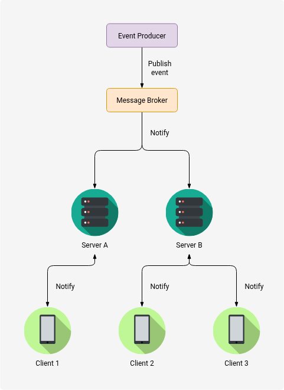

import Callout from '@/components/Callout.astro'

## Introduction
Long polling is a communication pattern that allows a client to receive real-time updates from a server using HTTP requests.
Unlike the traditional polling mechanism, where the client repeatedly sends requests at regular intervals,
long polling keeps the connection open until the server has new data to send.
This approach reduces latency, load on the server and network traffic,
as the server can push updates to the client as soon as they are available.

## How does long polling differ from traditional polling?
In traditional polling, the client sends requests to the server at regular intervals (e.g., every few seconds) to check for updates.
This can lead to increased latency, as the client may have to wait for the next polling interval before receiving new data, even if the server has updates available.
Additionally, traditional polling can create unnecessary load on the server and network, as it requires frequent requests and responses, even when there are no updates to send.

In contrast, long polling allows the client to maintain an open connection with the server until new data is available.
This means that the server can push updates to the client as soon as they are ready, reducing latency and minimizing unnecessary requests.
The client only sends a new request after receiving a response from the server, which helps to optimize resource usage and improve
the overall efficiency of the communication between the client and server.

## How long polling works?
The long polling process can be summarized in the following steps:
1. The client sends an HTTP request to the server, indicating that it wants to receive updates.
2. The server holds the request open until it has new data to send or a timeout occurs.
3. When the server has new data, it sends a response to the client with the updated information.
4. The client processes the response and immediately sends another request to the server to wait for the next update.
5. This cycle continues, allowing the client to receive real-time updates without the need for constant polling.

This pattern creates the illusion that the server is pushing updates to the client, even though it is still using HTTP requests.
The client always has a pending request to the server waiting at the server, ready to receive data the moment it becomes available.

## Implementation details
The default implementation of long polling is to have servers with asynchronous handlers that can manage multiple concurrent connections without blocking.
When a client sends a request, the server which is subscribed to a message queue or event source will hold the request until it receives a new message or event.
Once a new message is received, the server will respond to the client with the new data and immediately start waiting for the next message.

## Implementation Challenges
When implementing long polling, there are several important considerations to keep in mind:

**Connection Limits:** The server must be able to handle a large number of concurrent connections, as each client will have an open connection waiting for updates.
This can be achieved using asynchronous programming models or by using event-driven servers (Node.js or Nginx) that can handle thousands of simultaneous connections in a single thread.

**Timeout Handling:** The server should implement a timeout mechanism to close connections that have been open for too long without receiving new data.
This prevents resource exhaustion and ensures that clients do not wait indefinitely for updates.

**Load Balancer Timeouts:** If a load balancer is used, it must be configured to allow for long-lived connections,
as some load balancers may have default timeouts that could interfere with long polling.

**Message ordering:** The server should ensure that messages are sent in the correct order and that clients can handle out-of-order messages if necessary.
This can be achieved by including timestamps or sequence numbers in the messages.

**Thundering Herd Problem:** If the server restarts or experiences a failure, all clients may attempt to reconnect simultaneously, causing a surge in traffic.
To mitigate this, clients can implement an exponential backoff strategy when reconnecting, or add random jitter to their reconnection attempts to spread out the load on the server.

**Mobile or Unreliable Networks:** Long polling may not perform well on mobile or unreliable networks, as it relies on maintaining a persistent connection.
Mobile devices frequently switch between different network types (Wi-Fi, cellular) and may experience intermittent connectivity, which can lead to dropped connections and increased latency.
In such cases, alternative approaches like WebSockets or Server-Sent Events (SSE) may be more suitable for real-time communication, as they are designed to handle these scenarios more efficiently.

A possible solution is to use shorter timeouts on the client side, allowing it to reconnect more quickly if the connection is lost or the network conditions change.
