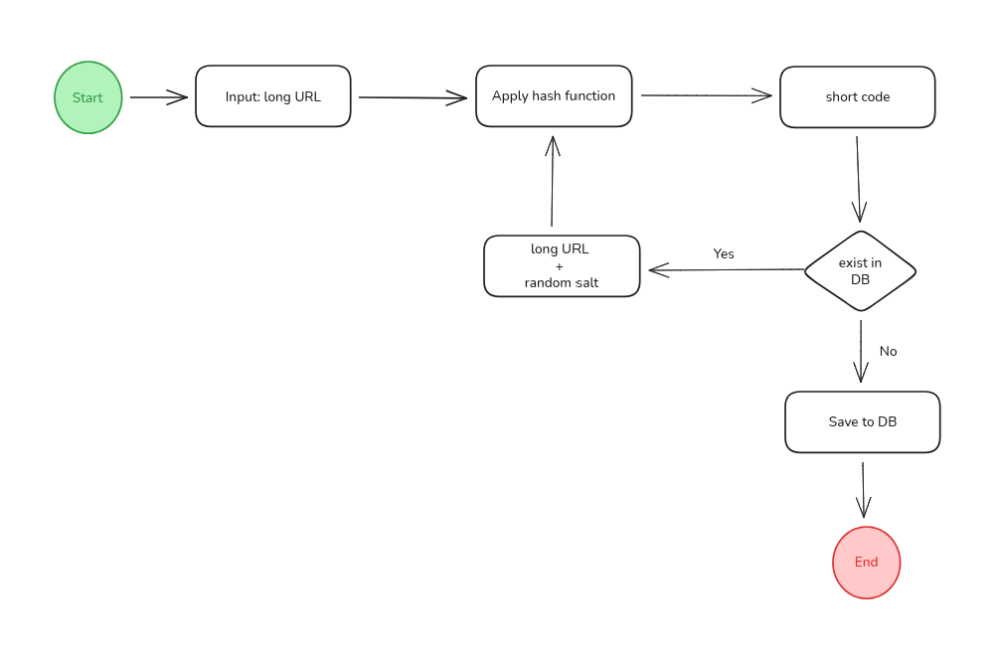
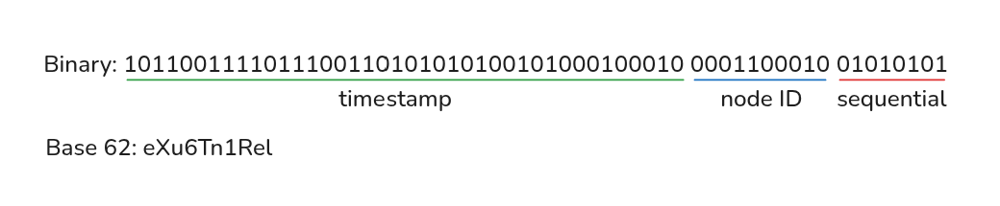
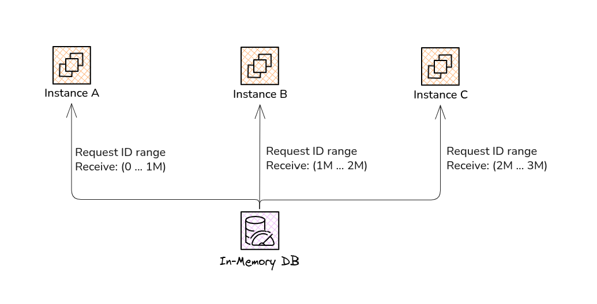
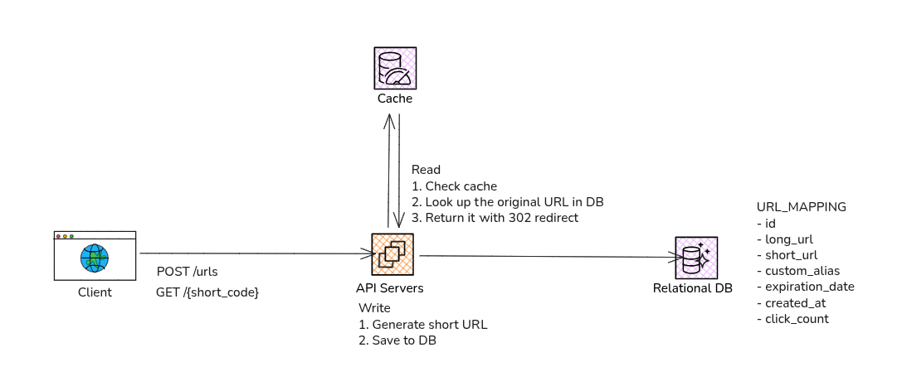

import Callout from '@/components/Callout.astro'

Now that we have a high-level design of our URL shortener, we can start to dive deeper into the specific components
and technologies that we will use to implement our system.

## The Redirect Response
When a user accesses a short URL, our server needs to respond with an HTTP redirect to the original long URL.
This can be done using the HTTP status code 302 (Temporary Redirect) or 301 (Permanent Redirect), depending on whether
we want to indicate that the short URL is temporary or permanent.

Since we want to allow users to set expiration dates for their short URLs, it makes sense to use the 302 status code,
which indicates that the redirect is temporary and may change in the future.

## Generating global unique short codes
Generating unique short codes is a critical part of our URL shortener design.
We need to ensure that each short code is unique and can be easily mapped back to the original long URL.
To do this, we can use a variety of techniques, the most common are:

#### 1. Hash functions
We can use a hash function like SHA-256 to generate a fixed-size hash code. A hash function takes an input and return
a fixed-size string of characters in a way that the same long URL will always generate the same hash code.

But we cannot use the entire hash string, its too long and negates the purpose of using a URL shortener
To solve this we can use a substring of the generated hash code, for example: take only the first 7 characters of the hash string.
Doing this, gives as a small short code but increases the occurrence of collisions.

To solve the problem of collisions, each time that we generate a short code for a long URL, we can verify if it already exists in the database
If it do not exist, we try to generate a short code again, but this time appending a random salt to the long URL
Then we repeat the same process at max 5 times until we have a short code that was not generated before.

<Callout title="Unique constraints" variant="note">
  To use this approach we need to add a UNIQUE constraint to the short_code
  And optionally  to the long_url to avoid creating different short codes for the same URL
  if this is desired.
</Callout>

<Callout title="When thing become too complex..." variant="remark">
  In my opinion, when a candidate solution must rely on a bunch of workarounds to handle edge cases, I believe
  it is a sign that we should consider other approaches. So, even though this approach is simple and easy to implement,
  I would not recommend it for a production system due to the potential for collisions and the complexity of handling them.
</Callout>

#### 2. Base62 encoding of an auto-incrementing ID
Base conversion is another approach commonly used in URL shorteners.
This type of conversion helps to convert a number between its different representations in alternative numeric base systems.
Base 62 is used, because it allows 62 possible characters for the short code: 10 numeric values (0-9) + 26 lowercase letters (a-z) + 26 uppercase letters (A-Z).
We have 62 possible characters for each position in our short code, so:

N. unique short codes = 62 ^ short code length

How many time do we have to multiply 62 by itself  to result in a number greater than 1 billion?

$$
62 ^ 1 = 62 \newline
62 ^ 2 = 3844 \newline
62 ^ 3 = 238.328 \newline
62 ^ 4 = 14.776.336 \newline
62 ^ 5 = 916.132.832 \newline
62 ^ 6 = 56.800.235.584 \newline
$$

So, with a short code of 6 characters we can have more than 56 billion unique codes.

<Callout title="URLs exposing sequential IDs" variant="problem">
  We cannot expose sequential ids in the URLs, even if they are encoded in a different numeric base. This is because it can lead to security issues,
  such as **enumeration attacks**, where an attacker can easily guess and access other short URLs by incrementing or decrementing the ID in the URL.
</Callout>

A solution to this problem is to use Sqids (also known as **hashids**), they are a set of algorithms used to obfuscate the use of numeric sequential ids.
They do this by converting a integer to a given numeric base and shuffling the result with a secret salt, so the outputs dont look sequential.

In other words, it shuffles the alternate base representations of integers in a deterministic way.
Then we use this hashid representation as the short code in our URL.

<Callout title="Regular base 62 conversion" variant="example">
  | Base 10 | Base 62 |
  |---------|---------|
  | 1000    | c1      |
  | 1001    | c2      |
  | 1002    | c3      |
  | 1003    | c4      |
</Callout>

<Callout title="Applying HashIds" variant="example">
  | Base 10 | Base 62 |
  |---------|---------|
  | 1000    | c3      |
  | 1001    | c1      |
  | 1002    | c4      |
  | 1003    | c2      |
</Callout>

If this is not secure enough, we can also append a random small salt of a random size to the generated short code at the
start or at the end of the string to obfuscate the use of hashids.
We can preserve the uniqueness of the short code by not modifying its base 62 representation contained in the middle of the string.

#### 3. Snowflake-style ID generator
In this approach, we can generate unique IDs in a decentralized way without relying on the database's auto-increment feature.
This can be achieved by using a Snowflake-style ID generator, which is a distributed unique ID generation algorithm
that generates 64-bit unique IDs based on the current timestamp, a node identifier, and a sequence number.

For our case, we can allocate the bits of the generated ID as follows (59 bits total):
- 41 bits for the timestamp (in milliseconds since a predefined epoch) - Maximum of 69.7 years of unique IDs
- 10 bits for the node ID (to identify the server instance that generated the ID) - Maximum of 1024 nodes
- 8 bits for the sequence number (to allow multiple IDs to be generated in the same millisecond) - Maximum of 256 IDs per millisecond

After generating IDs in this format, we can convert their values to base 62 and use the result as the short codes
To have an idea of what will be the average size of a short url using this algorithm, we need to search the minimum value of N where `62^N >= 2^59`

$$
2^{59} = 576,460,752,303,423,487
$$
$$
62 ^ 1 = 62 \newline
62 ^ 2 = 3,844 \newline
62 ^ 3 = 238,328 \newline
62 ^ 4 = 14,776,336 \newline
62 ^ 5 = 916,132,832 \newline
62 ^ 6 = 56,800,235,584 \newline
62 ^ 7 = 3,521,614,606,208 \newline
62 ^ 8 = 218,340,105,584,896 \newline
62 ^ 9 = 13.537.086.546.263.552 \newline
62 ^ {10} = 839,299,365,868,340,224 \newline
$$

We can conclude that in average, our short code will have a size of **10 characters**.

#### 4. Centralized ID generation: ID range leasing
In this approach, we can create a dedicated component responsible for generating unique IDs for our URL shortener.
This service can use a variety of techniques to generate unique IDs, such as using a distributed lock to ensure that
only one instance of the service can generate an ID at a time, or using a combination of the current timestamp and a random number to create unique IDs.

But i think that the most efficient way is to use a technique called **leasing**. In this technique,
the ID generation component can pre-allocate a block of IDs (e.g., 1 million IDs) and lease them to one instance of the URL shortener service.

This instance can then generate short codes using the leased block of IDs without needing to communicate with the ID generation service for each short code generation.
When the instance runs out of IDs in its leased block, it can request a new block of IDs from the ID generation service.
This approach allows us to generate unique IDs efficiently while minimizing the communication overhead between the URL shortener service and the ID generation service.

## Handling performance issues
A good URL shortener service must be capable of finding the right match for the short code in the database as quickly as
possible to ensure a smooth user experience. The speed of this search is crucial for this kind of service.

In this challenge we have a projection of 100 million active users per day.
Additionally, let's assume that each of these users perform 5 redirects per day. That is:
- 100.000.000 users * 5 redirects = 500.000.000 redirects per day
- 500.000.000 redirects / 24 hours / 60 minutes /60 seconds = 5787 redirects per second

Peak QPS: 2 * 5787 = 12.000 redirects/s

#### Adding column indexes
To avoid what we call a full table scan, we can use a technique called indexing.
In database terms, an index creates a sorted map of our short URLs, each with a pointer to the full data stored in the main table.
Usually the index structure is stored on disk as a **B-Tree** or **B+Tree**, then the search for a record can be performed through a tree walk in O(logN).

#### Caching frequently accessed URLs
To improve the redirect speed, we can introduce an in-memory cache like Redis or Memcached between the application and the database.
This cache can store the frequently accessed URL mappings.
When a redirect request comes, the server first check the cache.
If the short code id found in the cache, the server retrieves the URL info from the cache, significantly reducing the latency.
If the short code is not found in the cache, the server then searches the database and store the result in the cache for future requests.

[//]: # (- Memory access time: ~100 nanoseconds &#40;0.0001 ms&#41;)
[//]: # (- SSD access time: ~0.1 ms)
[//]: # (- HDD access time: ~10 ms)
[//]: # (Memory access is 1000 times faster than SSD and 100.000 times faster than HDD)
[//]: # (- Memory: supports millions of reads per second)
[//]: # (- SSD: ~100.000 IOPS &#40;Input/Output Operations Per Second&#41;)
[//]: # (- HDD: ~100-200 IOPS)

## Handling scalability issues
One of the main challenges in designing a URL shortener is ensuring that it can scale to handle a large number of
requests and a growing database of URL mappings.
In this section, I will discuss some of the strategies and techniques that can be used to address scalability issues in a URL shortener design.

#### Data storage
For the date storage we have the following projections:
- 4 bytes for the auto-incremented id
- 10 bytes for the short code
- 100 bytes for the long url
- 100 bytes for the custom alias
- 8 bytes for the expiration date
- 4 bytes for the creator id

This gives us something like ~300 bytes per row. 300 bytes * 1B rows = 300GB of data
If we want to add more columns for created_time, analytics id, or any other features, we can round up to 500 bytes per row or 500GB of data.

Estimating that 100k rows are created per day, we have ~1 row inserted per second.
Since we have offloaded the heavy read throughput to a cache, any reasonable databases can handle these requirements.

#### Database replication
In our simple design, the database turns into a single point of failure.
To handle this problem and provide high availability, we can make use of database
replication by using a DB system like Cassandra.
By applying DB replication we divide our replicas in two groups, one instance will be the primary (where we execute our writes),
and the other instances will be the standbys (where we execute the reads)
every time that we execute a write operation on the primary, the data is recorded and a WAL(Write Ahead Log) is
streamed to some of the standby replicas, so they can update their global state.
Then these updated standby replicas cascade this WAL to the remaining standbys.

Using database replication adds another layer of complexity to the system, since we have to ensure that our application
can interact with any replica without issues and
correctly identify their roles to perform operations (primary -> writes and standbys -> reads).

## Using CQRS
Since the difference between the volume of read operations and write operations can be very large. We can consider to separate our main application into
two different services: The Write Service will handle the creation of short URls, while the Read Service will be responsible by the redirection logic.
This separation allows us to scale each service independently based on specific demands.

## Final Architecture
And here is the final architecture of our URL shortener system, incorporating all the components and techniques
that we have discussed in this deep dive:

