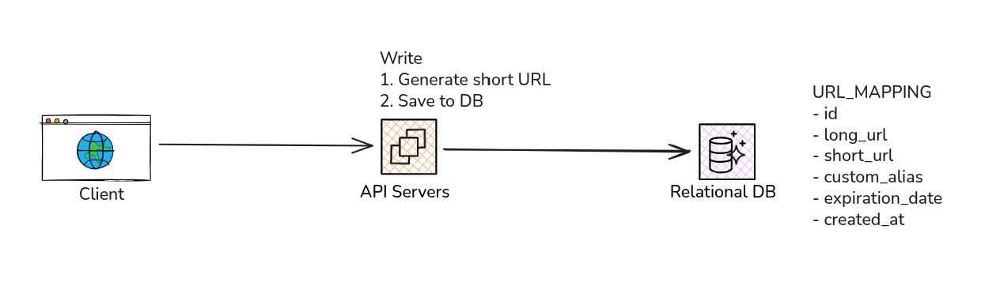
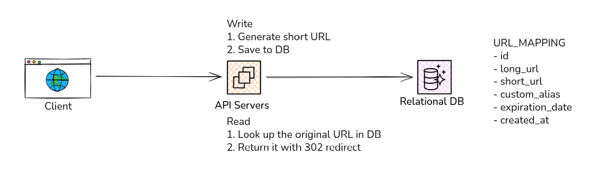

import Callout from '@/components/Callout.astro'

Ok. Let's start to draw our first diagrams. For this specific problem, we can divide the data flows into two
main categories: the data flow for **creating a short URL** and the data flow for **redirecting to the long URL**.

## Data flow: creating a short URL

#### Flow explanation:
1. The API receives the request and validates the long URL
2. The long URL format and value is validated and canonized (remove ports, normalize trailing slashes, lowercase hosts, etc.)
3. We check if the URL already exists in our system database
4. If it already exists, we return the pre-existent short URL.
5. If it does not exist, we generate a unique code to identify the URL.
6. If the user has specified a custom alias, we can use that as the short code (after validating that it does not already exist)
7. If the user has specified an expiration date, we add it to the record
8. Insert the new record to the database

## Data flow: redirecting to the long URL

#### Flow explanation:
1. The user's browser sends a GET request to our server with the short code (e.g., GET /abc123)
2. The server receiver the request and look up for the corresponding long URL using the short code
3. If the short code is found and has not expired (by comparing the current date to the expiration date in the database), the server retrieves the long URL
4. The server sends an HTTP redirect response to the user browser, instructing it to navigate to the original long URL.