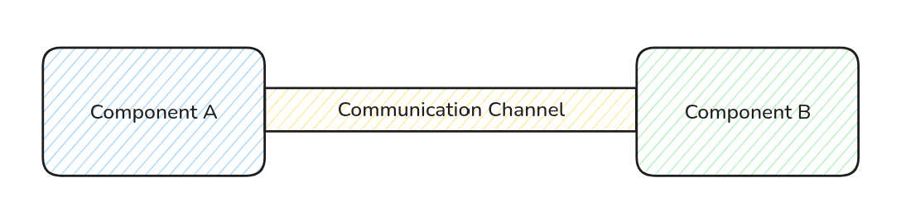
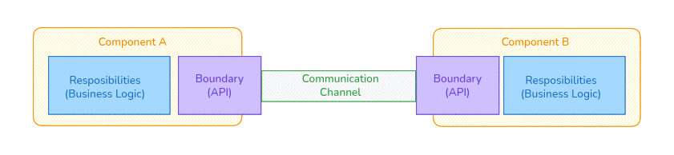
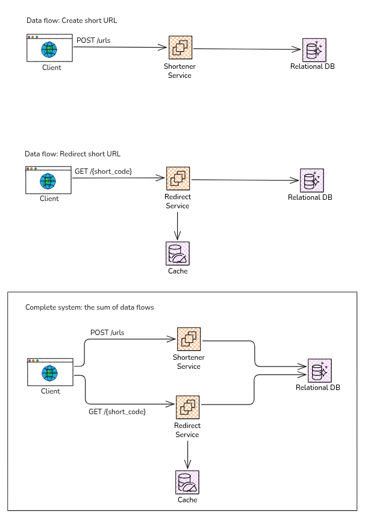

## Introduction
What is a mental model?

To me, a mental model is just a way you picture how something works. It’s the internal “map” you use
to make sense of a concept, a field, a problem, or even a whole system. It helps you understand what’s going
on, and more importantly, decide what to do about it.

Whenever I’m diving into something new, I don’t just focus on facts or techniques.
I try to figure out the mental models that experienced people in that space are using. How do they think about the
subject? What do they pay attention to? How do they approach problems? How do they make trade-offs? How do they design solutions?

If you can understand someone’s mental models, you’re basically getting a peek into how their brain organizes the problem.

I’ve found this to be one of the fastest ways to learn. Instead of starting from scratch, you’re borrowing the thought
process of someone who’s already good at the thing. You’re learning by imitation, by example, which is incredibly powerful.

Here I will share some mental models that I have learned about system design. These are not the only mental models
that exist, but they are some of the ones that I personally find most useful.

## A system is composed of components and communication

The goal of this model is to you train yourself to see any system as something built from two ingredients:
the parts that do the work, and the interactions that let those parts work together.

Instead of memorizing patterns as isolated tricks, we can start building a stable intuition:

> if I can identify the parts
and understand how they interact, I can reason about almost any architecture, no matter how simple or complex it looks on paper.

But first, we need to understand what those two ingredients actually are.

#### Components
**Components** are the “what.” They’re the parts of the system that carry responsibility.

A component isn’t defined by its shape. It’s not “a service,” “a database,” or “a module.” Those are implementation details.
**What actually defines a component is the boundary it draws around a specific responsibility.**

A good boundary makes ownership obvious. It’s clear what this component must reliably do, what assumptions it’s allowed
to make, and just as importantly, what it does not handle. That last part matters more than people think.

When responsibilities are blurry or mixed together, the whole system becomes harder to reason about.
You don’t know where a behavior belongs. You don’t know where a failure should be contained. And when something breaks,
everyone squints at the same diagram trying to figure out whose problem it is. Clear components reduce that confusion.

#### Communication
**Communication** is the “how.” It’s what turns a bunch of components into an actual system instead of a random pile of parts.

When designing a system, it’s important to think about both the components and the communication.
You need to consider how the components will work together, what kind of communication they will need, and how to
design that communication effectively.

Communication can also be understood as the expectations wrapped around the interactions between these components.
What counts as success? What counts as failure? How long do we wait before timing out? What happens if a message shows up twice?
Or late? Or out of order? What if the network is slow or flaky?

Those details are the system.

In practice, most serious system failures aren’t because a single component is badly written.
They happen because the interactions weren’t clearly designed.
A component can work perfectly in isolation and still cause chaos when combined with others.

That’s why thinking carefully about communication is just as important as defining clean components.
One gives you structure. The other determines whether that structure actually holds together under pressure.

## A component is composed of responsibilities and boundaries
A component is not “a service” or “a class” or “a database” by default.
Those are implementation shapes.
A section of your system becomes a component when it takes ownership of a responsibility and draws boundaries around that ownership,
so everyone else knows what it will do, what it will not do, and how to interact with it safely.

#### Responsibility
Responsibility is the positive definition of a component.
It answers a very simple but powerful question: what is this thing actually for?

And it has to answer it in a way that’s concrete enough to guide decisions.
Not vague mission-statement stuff, but something you can use when you’re about to add a new feature and you’re wondering, “Does this belong here?”

A strong responsibility gives the component a reason to exist.
It protects it from that slow, subtle decay where people keep tossing unrelated behavior into whatever place already exists because it’s convenient.
That’s how systems quietly turn into junk drawers.

When responsibility is fuzzy, everything starts to blend together.
When it’s clear, the component becomes a stable unit that you can evolve without constantly breaking things that have nothing to do with it.

#### Boundary
Boundaries are the flip side. If responsibility is the positive definition, boundaries are the negative one.
They answer: where does this responsibility stop?

A boundary defines what the component refuses to care about.
What it treats as external.
What it expects someone else to provide.

Without boundaries, there’s no clean mental map. Everything can reach into everything else.
A small change in one place ripples unpredictably across the system. You end up afraid to touch anything.

With clear boundaries, change becomes localized. The rest of the system depends on the component’s interface and
guarantees, not its internal details. And that separation is what makes evolution possible without chaos.

## A system is composed of data flows
To understand this model is to visualize a system as a set of movements of data.
Something produces data, something transforms it, something stores it, and something consumes it.

I think the best way to understand this model is to create a parallel with use cases or user journeys. Let's use an URL shortener as an example.
We have two main use cases: creating a short URL and redirecting to the original URL.
We can understand these two use case as two different data flows.

**Create short link:** This one starts with the user input (the original URL), then moves through validation, then being stored in a database, and finally being used to create a short URL.

**Link redirection:** This one starts with the user input (the short URL), then moves through validation, then being used to look up the original URL in the database, and finally being used to redirect the user.

When designing a system, **we often model one data flow for each functional requirement**, and then we join them together to get the full picture of how the system works.

## Load is variable
Load is variable is your reminder that a system never runs under one set of neat and stable conditions.
**Traffic is not constant. It shifts throughout the day, the week, or the year.**
It can spike suddenly due to a viral post, a news event, or a competitor’s outage.
It can drop just as fast when people lose interest or switch to something else.

Designing a system as if the average load is the truth is a recipe for disaster.
You need to account for that variability, and design for the worst-case scenarios, not just the average ones.

Internalizing this model changes what you optimize your system for.
**Instead of just trying to be efficient under normal conditions, you develop your system to be resilient across a range**.

## Failures are normal
Failures are NOT an edge case. They are a fundamental part of how systems operate in the real world.
Hardware can fail, software can have bugs, networks can go down, and users can do unexpected things.
Even the best-designed systems will encounter failures at some point.
The question is not if, but when.
Accepting this reality is crucial for designing systems that can handle it gracefully.
When you internalize that failures are normal, you start to design with that in mind.

This concept is closely related with defensive programming but applied in a higher scope. Defensive programming is a design approach that anticipates and handles potential failures
or unexpected inputs in a way that prevents them from causing larger issues.
It’s about building robustness into your system, so that when something goes wrong, it doesn’t bring everything down with it.

When you design with the expectation of failure, you start to implement strategies like redundancy, fail-over mechanisms, and graceful degradation.
You also become more proactive about monitoring and alerting, so you can detect and respond to failures quickly.
This mindset shift is essential for building systems that are reliable and resilient in the face of real-world conditions.

## What can be derived from these models?
The mental models I shared are not just abstract concepts. They have practical implications for how you design systems.
Here are some of the key takeaways that you can apply in your own work:

- **Reliability is about how the system behaves when communication fails.**
- **Availability is about how the system behaves when components fail.**
- **Scalability is about how communication behaves when volume grows.**
- **Performance is about how communication behaves when time becomes a constraint.**
- **Maintainability is about how easy it is to change the system without breaking communication.**
- **Security is about how well the system protects communication from unauthorized access or tampering.**
- **Observability is about how well you can understand and debug communication when things go wrong.**

I think that's it for now. I really believe that internalizing these mental models can help you design better systems, and I hope you found them useful.

Until the next post!