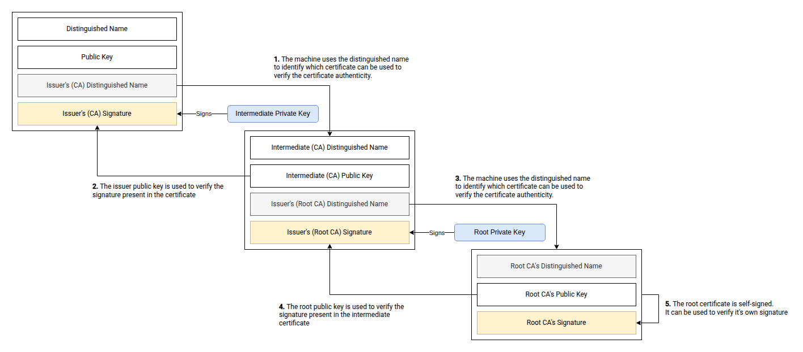

## Digital certificates
A digital certificate is a file used to prove the identity of a website, service, or user in a networked system.
It contains a public key and basic information about the owner, and it is digitally signed by a trusted authority.
When a client connects to a server over HTTPS or another secure protocol, it checks the certificate to confirm that the
public key really belongs to that server and that it was issued by a trusted authority.

If the verification succeeds and the certificate is valid (not expired or revoked), the client can establish an
encrypted connection with confidence that it is communicating with the intended party.

## Certificate structure
TLS certificates follow the [X.509 standard](https://datatracker.ietf.org/doc/html/rfc5280), which defines the format of public key certificates.
An X.509 certificate contains the following fields:
- Version: The version of the X.509 standard used to create the certificate.
- Serial Number: A unique identifier for the certificate.
- Signature Algorithm: The algorithm used to sign the certificate.
- Issuer: The name of the entity that issued the certificate.
- Validity Period: The start and end dates during which the certificate is valid.
- Subject: The name of the entity that the certificate represents (e.g., a website or a user).
- Subject Public Key Info: The public key associated with the subject.
- Extensions: Additional information about the certificate, such as the intended use of the certificate or the policies under which it was issued.

From these fields, the most important ones for our discussion are the Issuer and the Subject fields,
as they help us understand the concept of trust in digital certificates.

But, what is a trusted authority? How do we know which digital certificates and issuers are trustworthy and which are not?

## Certificate Authorities (CA)
Technically, anyone can create a digital certificate and sign it with their own private key, but that would not be
very useful because there would be no way to verify the authenticity of the certificate.
This is where Certificate Authorities (CAs) come into play.

CAs are trusted entities that issue digital certificates to organizations and individuals after verifying their identity.
When a CA issues a certificate, it signs it with its own private key, which allows clients to verify the authenticity of the
certificate by checking the CA's signature.
CAs are responsible for maintaining a list of trusted certificates and revoking certificates that are no longer valid.

These CAs entities are seen as reliable and "official" due to their history, reputation, influence, and the rigorous processes they
follow to verify the identity of certificate applicants.

In our network systems, these CAs are known as Root Certificate Authorities (Root CAs).

## Root Certificates Authorities
Today, there is approximately 150 Root CAs that are widely recognized and trusted by web browsers and operating systems.
These Root CAs are responsible for issuing digital certificates to organizations and individuals, and they play a crucial
role in maintaining the security of the internet.

Among them we have some very well-known Root CAs, such as:
- DigiCert
- GlobalSign
- Let's Encrypt
- Comodo
- Symantec
- GoDaddy
- Entrust

Ok. We have a list of trusted Root CAs, that is great, but we really have the authenticity of every certificate issued by these Root CAs?

No, we don't.

The reason is that Root CAs do not issue certificates directly to end-users or organizations.
Instead, they delegate this responsibility to Intermediate Certificate Authorities (Intermediate CAs).

## Intermediate Certificate Authorities
Intermediate CAs are entities that are authorized by Root CAs to issue digital certificates on their behalf.
They act as a bridge between the Root CAs and the end-users or organizations that need certificates.
Intermediate CAs are responsible for verifying the identity of certificate applicants and issuing certificates that are signed by the Root CAs.
This delegation of authority allows Root CAs to maintain a smaller attack surface and reduces the risk of compromise.

So, the Root CAs issue certificates to Intermediate CAs, and the Intermediate CAs issue certificates to end-users or organizations.
This creates a chain of trust, where the authenticity of a certificate can be verified by following the chain of signatures back to a trusted Root CA.

## Self-signed certificates
Who signs the certificates of the Root CAs?

The answer is that Root CAs issue self-signed certificates, which means that they sign their own certificates with their own private key.
This is because Root CAs are the ultimate source of trust in the certificate hierarchy, and they need to establish their own identity
and authenticity without relying on any other authority.

Self-signed certificates are not trusted by default, but they can be added to the list of trusted certificates in web
browsers and operating systems to establish trust.

That is, you can select what Root CAs you want to trust by adding their self-signed certificates to your system's trusted certificate store.

## Chain of trust
The chain of trust is the process by which a system decides whether a digital certificate should be trusted.
It works by linking a certificate presented by a server back to a trusted root certificate that already exists in the client’s trust store.

When a server presents its certificate, that certificate is usually issued by an intermediate certificate authority rather than directly by a root.
The client verifies the server certificate’s signature using the intermediate’s public key, then verifies the intermediate certificate
using the next certificate up the chain. This continues until the client reaches a root certificate.
If that root certificate is trusted locally, and every certificate in the chain is valid (correct signatures, not expired,
not revoked, and used for the right purpose), the entire chain is trusted.

In short, the chain of trust allows clients to trust end-entity certificates without needing to directly trust every issuer,
as long as they ultimately connect back to a trusted root.

