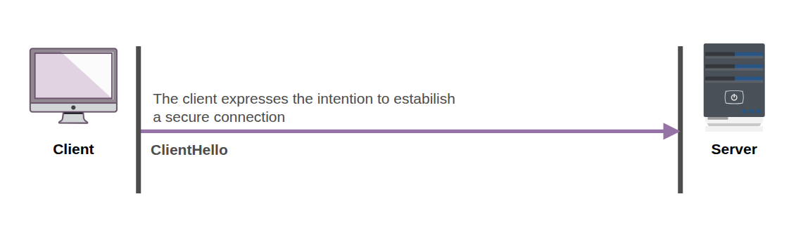
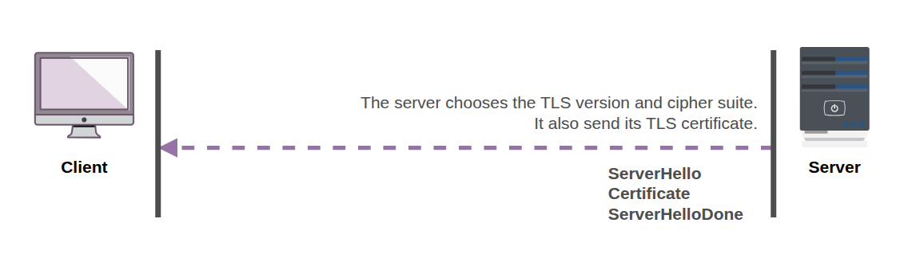
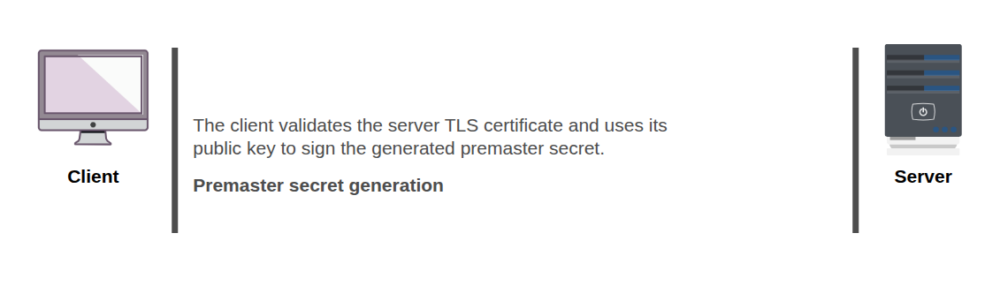
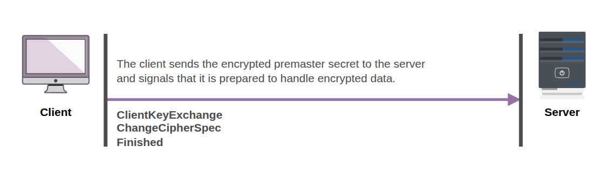
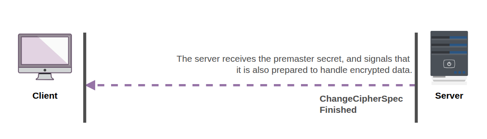
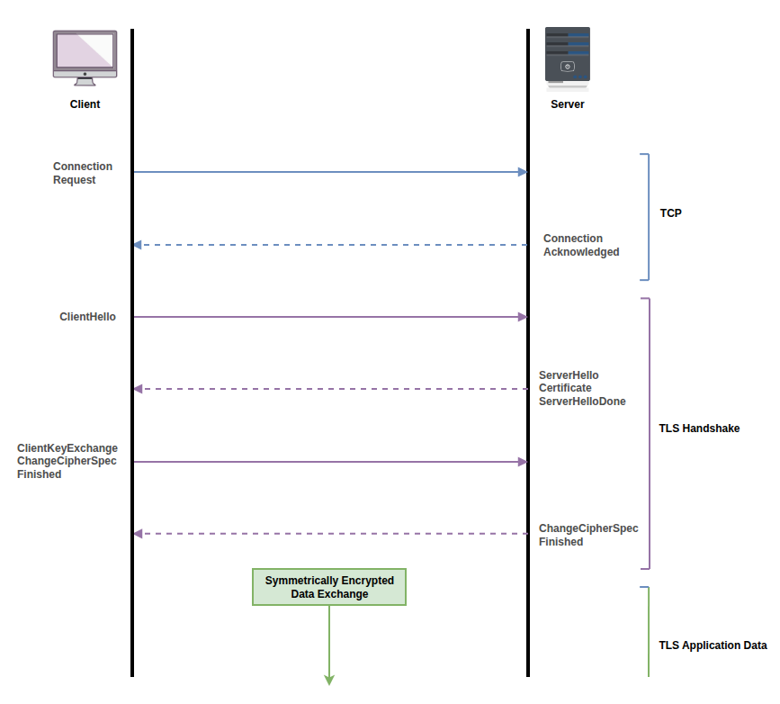

import Callout from '@/components/Callout.astro'

## Introduction
We can define TLS as a protocol that provides **privacy** and **data integrity** between two communicating applications.
It is the most widely used security protocol in the world, and it is used to secure a wide variety of applications,
including web browsing, email, instant messaging, and voice over IP (VoIP).

In this article, we will explore the basics of TLS/SSL and how it works.

## TLS vs SSL
TLS (Transport Layer Security) is the successor to SSL (Secure Sockets Layer). SSL was developed by Netscape in the mid-1990s,
but it had several security vulnerabilities that led to the development of TLS. TLS was first defined in 1999 as an upgrade
to SSL 3.0, and it has since become the standard for secure communication on the internet.
TLS and SSL are often used interchangeably, but they are not the same thing. TLS is a more secure and modern protocol than SSL,
and it is recommended to use TLS instead of SSL whenever possible.

## TLS Digital certificates
Before we dive into the TLS handshake, it is important to understand what digital certificates are and how they are used in TLS.
So, if you are not familiar with digital certificates, I recommend you to read the following article before proceeding:
- [TLS Digital certificates](./understanding_tls_ssl/digital_certificates)

## The TLS handshake
The heart of the TLS protocol is the handshake process. It is responsible for establishing a secure connection between the client and the server.
During the handshake, the client and server exchange messages to negotiate the parameters of the secure connection.

The handshake process steps vary depending on the TLS version and the cipher suite being used.
Here we will focus on the 1.2 version of the protocol, which is still widely used.

#### Step 1: Client Hello
The first step. Here is where the client shows its intention to establish a secure connection.
To do this, it sends a "Client Hello" message to the server, which includes the following information:
- The highest TLS version supported by the client
- A random number (used later in the key generation process)
- A list of supported cipher suites (encryption algorithms)
- A list of supported compression methods (optional)

<Callout title="Cipher suites" variant="note">
  Cipher suites are a combination of encryption algorithms that are used to secure the communication between the client and the server.
  They are used to negotiate the encryption method that will be used for the secure connection. A cipher suite typically includes:
  - A key exchange algorithm, used to securely exchange the premaster secret (e.g., RSA, Diffie-Hellman)
  - An authentication algorithm, used to authenticate the server (and optionally the client) (e.g., RSA, DSA)
  - A symmetric encryption algorithm, used to encrypt the data transmitted between the client and the server (e.g., AES, 3DES)
  - A message authentication code (MAC) algorithm, used to ensure the integrity of the data transmitted between the client and the server (e.g., SHA-256, SHA-1)
</Callout>

#### Step 2: Server Hello
The server receives the "Client Hello" message and responds with a "Server Hello" message, which includes the following information:
- The TLS version selected by the server (must be less than or equal to the version supported by the client)
- A random number (used later in the key generation process)
- The cipher suite selected by the server (must be one of the cipher suites supported by the client)
- The compression method selected by the server (optional)

After this step, both  the client and the server have agreed on the TLS version, the cipher suite, and the compression
method to be used for the secure connection.

#### Step 3: Server certificate
After the "Server Hello" message, the server sends its digital certificate to the client. The certificate contains the
server's public key and is used for authentication. The client will verify the certificate to ensure that it is valid and
that it belongs to the server it is trying to connect to. This TLS message contains the following information:
- The server's digital certificate (used for authentication)

#### Step 4: Server Hello Done
After sending the server certificate, the server sends a "Server Hello Done" message to indicate that it has finished its part of the handshake.
This message does not contain any additional information.

#### Step 5: Authentication
After receiving the server's certificate, the client verifies it by checking the following:
- The certificate is issued by a trusted Certificate Authority (CA)
- The certificate is valid (not expired)
- The certificate's domain name matches the server's domain name
If the certificate is valid, the client proceeds to the next step.
If the certificate is invalid, the client may choose to abort the connection or proceed with a warning.

#### Step 4: Premaster secret
If the certificate is valid, the client generates a random number called the "premaster secret" using the agreed-upon cipher suite.
The client then encrypts the premaster secret using the server's public key (from the certificate).
This ensures that only the server, which has the corresponding private key, can decrypt the premaster secret.

#### Step 5: Client Key Exchange
The client sends the encrypted premaster secret to the server in a "Client Key Exchange" message.
The server receives the encrypted premaster secret and decrypts it using its private key to obtain the premaster secret.

#### Step 6: Session keys created
Both the client and the server use the premaster secret, along with the random numbers exchanged in the "Client Hello"
and "Server Hello" messages, to generate the **Master secret** and then derive the same session keys from it. These session keys are used for encrypting and decrypting
the data transmitted between the client and the server during the **Application Data** phase of the TLS connection.

#### Step 7: Change Cipher Spec
After the session keys are created, the client sends a "Change Cipher Spec" message to the server to indicate that it will
start using the newly generated session keys for encryption.
The server responds with its own "Change Cipher Spec" message to indicate that it will also start using the session keys for encryption.

#### Step 8: Finished
After the "Change Cipher Spec" messages, both the client and the server send a "Finished" message to each other.
This message is encrypted using the session keys and contains a hash of all the messages exchanged during the handshake.
This allows both parties to verify that the handshake was successful and that there was no tampering during the handshake process.

#### Handshake complete
After the "Finished" messages are exchanged and verified, the TLS handshake is complete, and the client and server can
now securely exchange application data using the established session keys.

Here is a summary of the TLS handshake steps we just covered:

