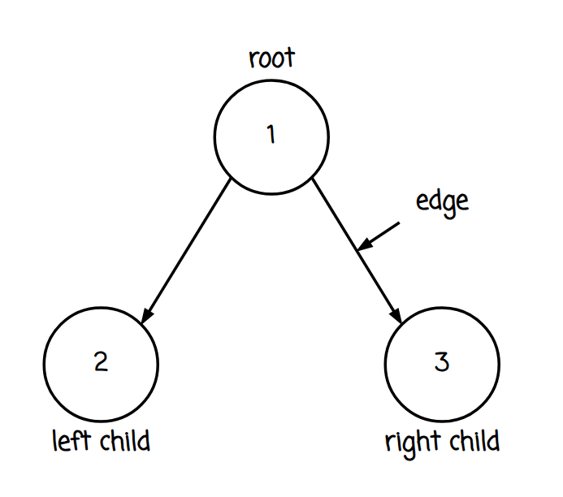
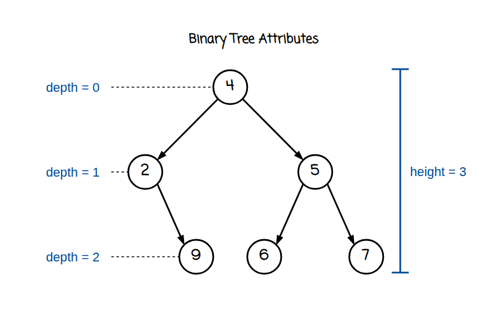
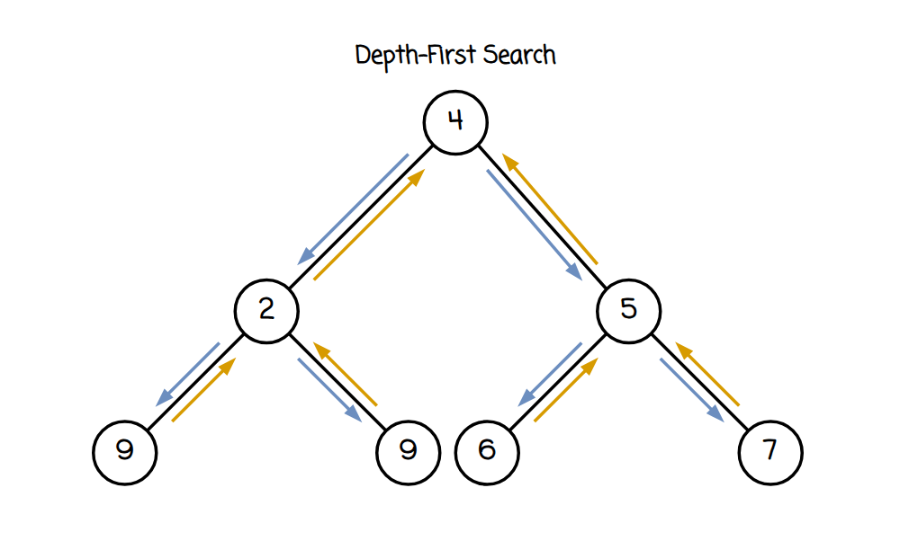

import Callout from '@/components/Callout.astro'

## Introduction
Depth-First Search, also referred to as **DFS**, is perhaps one of the foundational principles in Computer Science.
If you have been solving problems that involve **binary trees**, graph traversal, or recursive solutions, there is a
high probability that you have used DFS without realizing it.

To help illustrate DFS consider the example of navigating through a maze with multiple paths; you can think of DFS as
"following one path until you reach an end" before returning to try another path, rather than using a breadth-first
approach that spreads out in layers. This helps explain why DFS is referred to as "depth-first".

As a result, binary trees are the perfect data structure to use when learning about DFS, as the recursive nature of each
node directly parallels how DFS functions. When using a binary tree, each node will lead to two (or possibly none) other nodes,
creating two sub-trees. These sub-trees are essentially smaller representations of the same larger tree,
thus making them easy to visualize while learning DFS.

In this guide, we'll be breaking down DFS into manageable sections so that you can better understand how trees are traversed,
how the use of recursion within DFS drives its functionality and how many experienced software engineers begin each tree-based
problem by simply asking one very important question: **“What should my recursive function return?”**

## What is a Binary Tree?
A binary tree is a hierarchical data structure in which each node has at most two children, commonly referred to as the left child and the right child.
This structure allows for efficient searching, insertion, and deletion of elements, making it a fundamental component in various algorithms and applications.

#### Binary Tree Structure
In a binary tree, each node contains a value and references to its left and right children. The topmost node is called the root, and nodes with no children are called leaves.



#### Binary Tree Attributes
The depth of a node is the number of edges from the root to that node, and the height is the longest path from that node down to a leaf.



#### Binary Tree Code Example
Here is a simple implementation of a binary tree node in Python:
```python
class TreeNode:
    def __init__(self, value=0, left=None, right=None):
        self.value = value
        self.left = left
        self.right = right
```

## What is Depth-First Search (DFS)?
Depth-First Search (DFS) is a way to **traverse through a data structure (tree/graph)** by going as far down the
**branch you are on as you can go before coming back**.

To implement DFS in programming, you can use either **a recursive function** that uses your program's **call stack**
to keep track of where it came from so that it can come back to the previous node after it goes further down the tree,
or you can use an **explicit stack data structure**. A recursive function uses your program's call stack to keep track
of where you've been in order to be able to get back there when you're done with your current search.
That is exactly what happens in DFS.

When implementing DFS in a **binary tree**, you traverse the tree **along each branch until you reach the end of that
branch before you move onto the next branch**. Because each node in a binary tree has at most two children (a left child and a right child),
DFS will generally follow this pattern:



1. Visit the current node
2. Explore the left subtree
3. Explore the right subtree

But depending on _when_ we process the node relative to its children, DFS can produce different traversal orders.
These include **pre-order**, **in-order**, and **post-order** traversals.
Each variation is useful for different types of problems.

## Traversing a Binary Tree with DFS
The order of DFS traversals of a binary tree depends upon when the **current node is processed relative to it's child nodes**.
Because there are **two possible paths through each node (the left path and the right path)**, there must be a
**consistent policy as to which one should be done first**.
DFS traversal strategies answer exactly that question.

There are **three basic DFS traversal orders**:
1. **pre-order**,
2. **in-order**,
3. **post-order**.

All three use the same **recursive framework**, but the **processing of the node occurs at different points** in time.
These **small variations produce vastly different outputs sequences**, and determine the **type of problem the traversal will be best able to solve**.

Below is the general recursive structure that DFS uses on a binary tree:

```python
def dfs(node):
    if not node:
        return

    process(node)
    dfs(node.left)
    dfs(node.right)
```

The node is processed **prior to** it's children which generates a **pre-order traversal**,
by either moving the processing line above or below the recursive call, we can modify the ordering of the traversal.

This type of knowledge is also critical for understanding many other types of algorithmic techniques and/or methods that use similar traversal mechanisms.
For example, **in-order traversal** provides an efficient way to sort values of a Binary Search Tree (BST), where as **post-order traversal**
will provide a good method to perform computations based upon results generated from child nodes.

#### Pre-order Traversal
**Pre-order Traversal** process the current **node** before the **children of that node**.
Thus, a node is visited first, then the left subtree, and then the right subtree of that node.
The order of visiting is as follows:

**Node → Left → Right**

The pre-order traversal is generally useful for **building a picture of how a tree is structured**, and because each node is visited before its children,
the pre-order traversal can be seen as recording the tree in an "up-to-down" fashion.

Here is how the recursive form would look:

```python
def dfs(node):
    if not node:
        return

    visit(node)
    dfs(node.left)
    dfs(node.right)
```

#### In-order Traversal
**In-order traversal**, will process all of the nodes in the order:

**Left → Node → Right**

So, we go down to the very bottom of the **left tree** first, visit the **current node**, and then go down to the **right tree** as well.
Though this may seem similar to **pre-order traversal**, it has much greater implication for **Binary Search Trees (BSTs)**.

Here is what the recursive version of this looks like:

```python
def dfs(node):
    if not node:
        return

    dfs(node.left)
    visit(node)
    dfs(node.right)
```
<Callout title={"In-order Traversal and Binary Search Trees"} variant={"important"}>
  In-order traversal is particularly useful for Binary Search Trees (BSTs) because it will produce the values in sorted order.

  This is because in a BST, all values in the left child node are less than its parent node and all values in the right child node are greater than its parent node.
  So, when you perform an in-order traversal on a BST, you will visit the left subtree first (which contains smaller values),
  then the current node, and finally the right subtree (which contains larger values).

  This property of being able to produce ordered sequences based on traversals allows us to use this data structure in
  many algorithms that require ordering of some sort, or to validate that a given sequence of values could be produced by an In-Order Traversal of a BST.
</Callout>

#### Post-order Traversal
The post-order traversal visits a **node after both of its children have been visited**.
The post-order traversal can be broken down into three parts:

**Left → Right → Node**

The post-order traversal will visit the left subtree first then it will traverse the right subtree and finally visit the current node.
This is an important property for the post-order traversal as the **algorithm will dive fully to the bottom of the tree before beginning
to process the nodes that are above them**.

Below is an example of what the recursive version of this type of traversal may look like:

```python
def dfs(node):
    if not node:
        return

    dfs(node.left)
    dfs(node.right)
    visit(node)
```
This is a particularly good way to do tree traversals when the value of a **parent node depends on values calculated from its children**.
Many common tree based problems use this type of traversal.
Examples include finding the **height of a tree**, determining if a tree is **balanced**, and **finding the maximum path sum** in a tree.
All of these examples require knowledge of the values from the child nodes before they can compute the values for their respective parents.


## The core of DFS: Recursive Implementation
The first thing that has to occur before a DFS (Depth First Search) solution will work is to ask yourself one simple question,
"what will I return with each call to my recursive function?"
This is the key to developing both the elegance and efficiency of your tree algorithms.
Most beginners to DFS attempt to develop their own DFS algorithms by simulating the traversal step-by-step.
Unfortunately, this usually creates complicated code. Advanced developers have developed an alternative way of approaching DFS problems;
they define **the purpose of the recursive function**, or what it returns when it is called for a particular node.

Think of the recursive function as a contract. When a recursive function is called for a particular node,
it is obligated to return some specific information regarding the **subtree rooted at that node**.
When you know the contract you are obligated to meet, the rest of the code practically writes itself.

Suppose we want to find the **max-depth of a binary tree**. The contract would be defined such that:

<Callout title={"Contract"} variant={"note"}>
  For any node, return the maximum depth of the subtree rooted at that node.
</Callout>

Once the contract has been defined, the remainder of the code is very straightforward:

<Callout title={"Example: Max Depth of a Binary Tree"} variant={"explanation"}>
  The height of a tree that starts in the node N is the maximum height between the left and right subtrees plus one (to account for the current node).

  ```python
  height(node) = max(height(left), height(right)) + 1
  ```
</Callout>

All the node needs to do is ask the left child and right child how deep their respective subtrees are and combine those values together.

Using this same type of mentality greatly simplifies the majority of traditional tree problems.
Rather than thinking about **traversal order**, think about **information passed down from a node to another node**.
What information is sent from a node's children to their parents? How does the parent use that information?

When you approach DFS with this mindset you'll realize that the majority of DFS problems fit into a limited number of recurring patterns.
In fact, **almost all DFS problems can be categorized under three distinct information flow patterns**:

1. bottom-up information exchange
2. top-down state transfer
3. global accumulation of results

Knowing what pattern a problem fits into, greatly eases the design of a solution.
Rather than creating a new solution for each problem, you're able to create a known solution based on a common template.

Next we'll examine the three patterns in more detail.

## The three DFS information flows
One of the biggest benefits of studying **Depth-First Search** is recognizing how many other tree-based problems have the
exact same basic framework. Even though the problem may appear as very different on the surface, the movement of
information within the tree typically follows one of a few common patterns.

These patterns define **the flow of data between nodes during recursive traversal**.
When you know these patterns, solving problems using Depth-First Search will be much more systematic.

There are three primary ways to move information (data) during a Depth-First Search of a tree:

| Pattern            | Direction of Data Flow                                  |
|--------------------|---------------------------------------------------------|
| Bottom-Up          | Children send their results back to their Parent Node   |
| Top-Down           | The Parent Node sends information/state to its Children |
| Global Aggregation | Results are accumulated into a single global variable   |

Let's review the individual patterns below.

#### Bottom-up (Post-order)
The **bottom-up pattern** is one of the most common DFS strategies used in tree problems.
In this approach, when a node in the tree is processed, it uses information gathered from its children to calculate a new value that is passed to the parent.

This naturally aligns with **post-order traversal**, where the algorithm processes children before the parent node.

Most of the DFS tree problems use this strategy. Some examples include:
- Maximum tree depth
- Diameter of a binary tree
- Balanced tree checks
- Maximum path sum

The reason why this method works so well is that many tree properties are calculated based on **calculations done on sub trees**.
For example, to check if a tree is balanced, the height of the two child sub-trees need to be known, prior to calculating the height of the parent node.

An example of what a bottom up DFS function could look like is below:

```python
def dfs(node):
    if not node:
        return base_value

    left = dfs(node.left)
    right = dfs(node.right)

    result = combine(left, right)
    return result
```

In the above function, the recursive calls are doing the work for the deeper parts of the tree.
The parent node simply takes the results from its children and calculates a new value to pass back to its parent.

Since many tree properties rely on the results of its children's processing, the **Bottom Up DFS strategy has become the default strategy
for solving tree-based interview questions**.


#### Top-down (Passing state)
Another type of DFS strategy is **Top Down DFS**. Top Down DFS is the opposite of Bottom Up DFS;
instead of gathering information from its children, the algorithm will pass information **downward from the parent to its children** as it traverses the tree.

As opposed to passing values back to its parent node, the recursive function receives additional parameters that reflect
the state of the traversal at each level of the tree.

For instance, suppose you wanted to find out if there exists a **path from the root of the tree to one of the leaf
nodes such that the sum of the node values along that path is equal to some target value**. The algorithm would maintain a running sum of values as it descended the tree.

The recursive function might resemble something similar to the following:

```python
def dfs(node, currentSum):
    if not node:
        return

    currentSum += node.value

    dfs(node.left, currentSum)
    dfs(node.right, currentSum)
```

In this case, each recursive call inherits context from the parent node and uses that context to update itself as it continues down the tree.

- Top Down DFS is particularly effective at solving problems that involve:
- Path Sums
- Node Depths
- Constraints that relate to ancestors

Unlike Bottom Up DFS, which waits for child results before reporting, Top Down DFS is focused on **moving context downward
through the tree as the algorithm continues to descend**.

#### Global aggregation
The final DFS strategy utilizes a **global variable** to accumulate the results of the traversal process.
Instead of returning a complex set of values from each recursive call, the algorithm will update a global variable every time it finds a **better result**.

This strategy is commonly seen in problems that require tracking an **overall maximum or minimum value**.

One of the most well-known examples of this strategy is the **Maximum Path Sum Problem**.
In this problem, each recursive call will provide information about the **longest path upwards** from the node being processed,
but the algorithm will also update a global variable that tracks the longest path seen anywhere in the tree.

Here’s a simple representation of how this might look:

```python
maxValue = float('-inf')

def dfs(node):
    if not node:
        return 0

    left = dfs(node.left)
    right = dfs(node.right)
    global maxValue
    maxValue = max(maxValue, left + right + node.value)

    return max(left, right) + node.value
```

The recursive calls continue to report local information, however the global variable provides a way to track the **best solution overall** as the traversal continues.

This strategy is beneficial due to the fact that it **separates the local processing from the global processing**, simplifying the ability to solve difficult problems.

## Comparing DFS strategies
Although all three types of DFS utilize recursion and tree traversal, the **approaches of information flow are distinctly different**.
This understanding will assist with deciding on the appropriate DFS strategy for your problem in an efficient manner.

A basic comparison follows:

| Strategy           | Information Flow  | Typical Use Case          |
|--------------------|-------------------|---------------------------|
| Bottom-Up          | Children → Parent | Tree height, diameter     |
| Top-Down           | Parent → Children | Path sums, depth tracking |
| Global Aggregation | Shared variable   | Maximum path problems     |

Many real world problems will contain some type of combination of both strategies as they relate to DFS (bottom up recursion
combined with a global variable being updated concurrently).

Mastering the identification of hybrid DFS strategies (i.e., combinations of top down and bottom up approaches) will come with
experience and with time, you will begin to identify key elements within a problem statement that will allow you to determine
if the parent needs a result from the children or if data must be passed from the root to the leaf nodes.
If one of these conditions exist, then you can easily determine whether top-down or bottom-up will be the better approach.